[TOC]

# 心電図

## 読み方


## 感度・紙送り

感度は標準では、1mV＝10mm。振幅が大きい場合は二分の一にする。</br>
紙送り速度は標準では25mm/s

## 洞調律

洞結節で発生した興奮が刺激伝導系を介して正しく伝わっている状態。
以下のような特徴がある。

1. P波の後にQRS波が続く
2. I, II, aVFでP波が陽性
3. aVRでP波が陰性

さらに心拍が正常(50〜100回/分)のものを正常洞調律と言う。

## 波形の正常値

| 波形                | 幅                                     | 高さ                                         |
| ------------------- | -------------------------------------- | -------------------------------------------- |
| P波                 | 0.06〜0.10秒(およそ3マス以内)          | 0.25mV以下(1.5マス以下)                      |
| QRS波               | 0.06〜0.10秒(**大きい1/2マス以内**)    | 誘導により異なる                             |
| T波                 | 0.10〜0.25秒                           | 0.5mV以下(四肢誘導)<br />1.0mV以下(胸部誘導) |
| PQ時間              | 0.12〜0.20秒(**大きい1/2マス〜1マス**) | -                                            |
| QTc時間(補正QT時間) | 0.36〜0.44秒                           | -                                            |

## 軸偏位

| 右軸偏位                       | 左軸偏位                                                     |
| ------------------------------ | ------------------------------------------------------------ |
| 右室肥大<br />左脚後枝ブロック | 左室肥大<br />左脚前枝ブロック<br />房室中隔欠損症(AVSD)、心内膜床欠損症(ECD) |

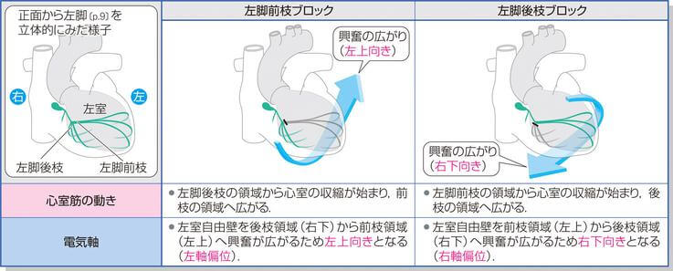

## 移行帯

通常、R波はV1からV6にかけて増高し、S波はV2をピークにして徐々に減高していく。
R波とS波の高さの比が1になるところを移行帯という。

移行帯は単独では病的意義が少なく、normal variantの場合が多い。
そのほかの心電図変化から判断する必要があるが、異常を探すきっかけにはなる。

### 反時計方向

| 移行帯の変化をきたす疾患 | 移行帯以外の主な心電図変化                                   |
| ------------------------ | ------------------------------------------------------------ |
| <u>健常人</u>            |                                                              |
| 右室肥大                 | 右軸偏位、右房拡大<br />右側胸部誘導での陰性T波              |
| 完全右脚ブロック         | QRS時間の延長<br />V1とV2誘導でのrSR'パターン                |
| 後壁梗塞                 | V1とV2誘導でのR波とT波の増高<br />下壁梗塞との合併が多いので、下壁梗塞の所見(II, III, aVFの変化)を見るのも良い |

### 時計方向

| 移行帯の変化をきたす疾患 | 移行帯以外の主な心電図変化                                   |
| ------------------------ | ------------------------------------------------------------ |
| <u>健常人</u>            |                                                              |
| 急性肺塞栓               | 胸部誘導での**陰性T波**、**S~I~Q~III~T~III~**<br />ただし、特異的な所見はないとされる |
| 慢性閉塞性肺疾患(COPD)   | I誘導での低電位差、肺性P波                                   |
| 前壁中隔心筋梗塞         | V1〜V3(V4)誘導での異常Q波                                    |

> **急性肺塞栓**
>
> S~I~Q~III~T~III~は特異度は高いが、感度はあまり高く無いとされる。
> その他の所見として、
>
> * 頻拍
> * 右室負荷所見

## QRS波の表記

| 着目点     |                                  |                                          |
| ---------- | -------------------------------- | ---------------------------------------- |
| 波の大きさ | 大きい場合(およそ5mm[0.5mV]以上) | 大文字(Q,R,S)                            |
|            | 小さい場合(およそ5mm[0.5mV]以下) | 小文字(q,r,s)                            |
| 波の向き   | 最初の陽性波                     | R波(r波)                                 |
|            | R波(r波)に続く陰性波             | S波(s波)                                 |
|            | R波(r波)の前の陰性波             | Q波(q波)                                 |
| 波の数     | 陽性波が2つある                  | 一つ目：R波(r波)<br />二つ目：R'波(r'波) |
|            | R波(r波)に続き陰性波が2つある    | 一つ目：S波(s波)<br />二つ目：S'波(s'波) |
|            | QRS波全体が陰性波のみ            | QSパターン                               |


## P波の見方

### 正常P波

P波の初め1/3は右房、終わり1/3は左房、中間の1/3は両房の興奮を表している。
右房は心臓の最右側に、左房は最後方にあるので、心房の興奮は常に左下方、前半は前方、後半は後方となる。
したがって、<u>II誘導は左足から心臓を眺めているので、右房・左房の興奮は共に電極に近づき、P波は**陽性**</u>となる。
しかし、<u>V1・V2誘導では左房の興奮は電極から遠ざかるので、P波は**二相性**</u>になる。

### 異常P波

P波は右房と左房が合成されて構成されている。
右房拡大では前半の右房成分は拡大するが左房成分の拡大はないので、振幅は高くなるが幅は広がらない。
左房拡大では左房成分が拡大するので幅が広がる。


### 右房拡大

II, III, aVF誘導で0.25mV以上の先の尖った形の高いP波(尖鋭P波や肺性P波と呼ばれる)、あるいはV1またはV2誘導での陽性部分が0.2mV以上のP波を認めた場合に右房拡大とする。P波の幅は広がらない。

### 左房拡大

I, II誘導で二峰性で幅の広い0.10秒以上のP波あるいはV1誘導で二相性で陰性部分の大きいP波を認めた場合に左房拡大とする。
P-terminal force(Morris指数)で0.04秒・mm以上を左房拡大とする。

> **P-terminal force(Morris指数)**
>
> V1のP波の陰性部分の幅(秒)と深さ(mm)の積から算出
>
> 

### 両房拡大

四肢誘導で0.25mV以上の尖鋭で、かつ0.10秒を超える幅広いP波、あるいはV1のP波が二相性で、前半の陽性部分が尖鋭化し、後半の陰性部分の振幅も大きく幅も広い場合。

### 陰性P波

aVRでの陰性P波は正常
II, III, aVF誘導で陰性P波を認める場合には、異所性心房調律や房室接合部調律が考えられる
一般的に異所性心房調律ではPQ時間が0.12秒以上になり、房室接合部調律では0.12秒未満になると言われているが、しばしば鑑別困難である。房室接合部調律ではP波がQRS波の直前に見られたり、QRS波に重なってP波が見られなかったり、QRS波の直後に見られたりする。
この他に、漏斗胸では胸骨が陥凹して心臓が左方へ圧排されるため、V1誘導でのP波の陰転化が見られる。

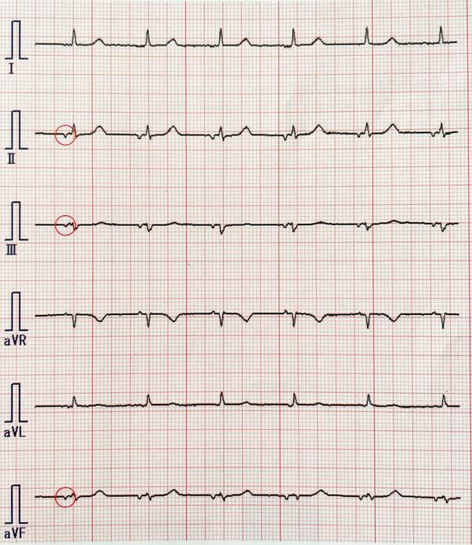

## S~I~S~II~S~III~パターン

全ての双極肢誘導で深いS波(R波≦S波)を有する心電図。
一般的に以下の３つのいずれかが考えられる

1. normal variant
2. 肺気腫
3. 右室肥大

肺気腫などの閉塞性肺疾患や右室肥大に伴う右室負荷の所見がなければ、normal variantが考えられる


## S~I~Q~III~T~III~パターン

**急性肺塞栓**の所見として有名。ただし、特異度は高いものの、感度はあまり高く無いとされる。
その他の所見として、

* 頻拍
* 右脚ブロック＋V1誘導でST上昇や陽性T波
* I, aVF誘導で1.5mmを超えるS波
* 時計方向回転
* aVF誘導でQ波
* 右軸偏位
* 四肢誘導で低電位
* aVFまたはV1〜V5で陰性T波

など多種多様な所見が見られることがある。

## 期外収縮

- 期外収縮
  - 上室期外収縮
    - 心房期外収縮
    - 房室接合部期外収縮
  - 心室期外収縮

通常の洞調律と期外収縮が交互に出現する場合を二段脈、洞調律2心拍の後に1回の期外収縮が出現することを三段脈という。
また、期外収縮が連続することを「連発」という。

### 上室期外収縮(APC：atrial premature contraction, PAC：premature atrial contraction)

頻度が高く、加齢とともに発生率は増加。
基本調律よりも早期に発生し、異所性刺激により発生するため、洞結節由来のP波と形が少し異なる(**異所性P波**)
QRS波は通常調律とほぼ同じ。
異所性P波の形が複数ある場合は、複数の場所から異所性刺激が発生していると考えられ、多源性の上室期外収縮を疑う。


> **心室内変行伝導**
>
> 心室の脚が完全に不応期を脱していない時期に上室から興奮が脚に達すると機能的な脚ブロックを生じ、上室期外収縮でもQRS幅が広くなることがある。
> <u>右脚ブロック型を示すものが大半を占めている。</u>これは右脚自体の長さが長い、走行が障害を受けやすい、不応期が左脚より長いなどが考えられている。

> **非伝導性上室期外収縮(blocked APC)**
>
> 上室期外収縮は早期に刺激が発生するために、房室結節の不応期が残っていると心室への伝導が途絶され、異所性P波だけでQRS波が脱落する場合がある。
> 以下の例では2拍目のT波が1・3拍目と異なっており、異所性P波が重なっていることがわかる。
>
> 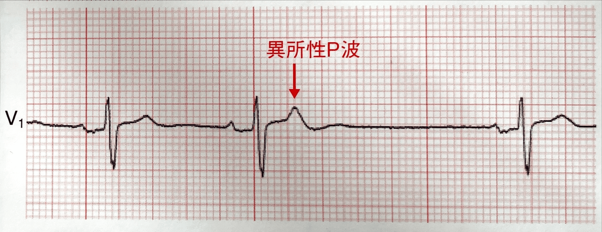

### 心室期外収縮(PVC：Premature Ventricular Contraction)

正常心拍より早期に心室より刺激が発生し、QRS波を形成する不整脈。
伝導速度の遅い固有心筋を伝導して心室を興奮させるため立ち上がりは緩慢で、QRS時間は0.12秒以上と広くなり、T波はQRS波と反対の極性を有する。
心室からの興奮のため、先行するP波を認めない。
なお、多くの場合P-P間隔は保たれるので、心室期外収縮の波形内に本来のP波を見ることがある。


#### PVCの起源

PVCの起源は心電図から推定することができる。
一般的には起源が左室にあれば右脚ブロック型、右室にあれば左脚ブロック型となる。ただし、左脚ブロック型の場合にはときに左室起源の時がある。
次に電気軸を見る。頭側起源のPVCは電気的興奮が頭側から尾側に向かうので、下から見る誘導(II, III, aVF)で上向きの高いR波(極端な右軸偏位)を示し、これを下方軸という。尾側起源ではこれと逆になるので、下から見る誘導では下向きの深いS波(極端な左軸偏位)を示し、これを上方軸という。

|                    |     下方軸     |     上方軸     |
| :----------------: | :------------: | :------------: |
| **右脚ブロック型** |  左室前壁起源  |  左室後壁起源  |
| **左脚ブロック型** | 右室流出路起源 | 右室心尖部起源 |

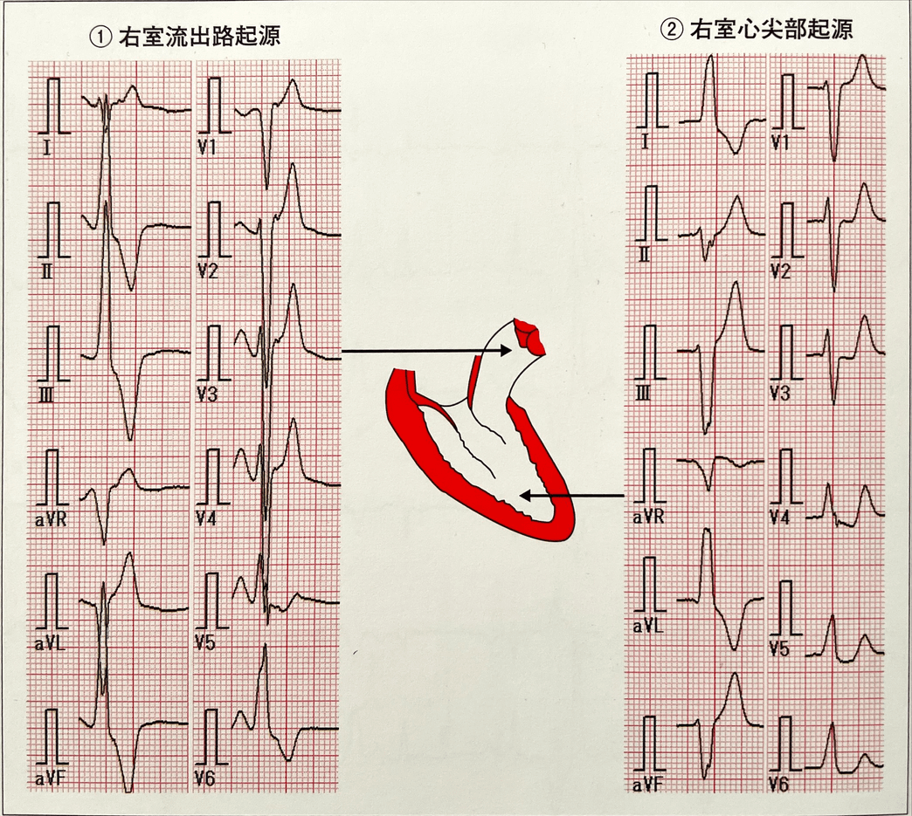

左室起源の時は、さらに側壁誘導であるIとaVL誘導から起源を推定する。
IとaVL誘導が下向きであれば、側壁起源、上向きであれば側壁と対側の中隔起源と考えられる。

#### 危険なPVC

心室期外収縮の中には、心室頻拍や心室細動などの致死的不整脈を誘発しやすいものがある。
基礎疾患に心筋梗塞がある場合にはLown分類という心室期外収縮の重症度分類を用いる。
危険な心室期外収縮とされるものには、

1. 頻発(記録された心電図のQRSの数の10%以上が心室期外収縮)
2. 連発
3. 多形性(複数の異所性起源)
4. R on T現象

の4つの病態がある。

> **心室頻拍(VT：Ventricular tachycardia)**
>
> 心室比その興奮起源を有する頻拍で、脈拍が100/分以上と定義される。
> 心電図上はQRS幅が0.12秒以上のwide QRS頻拍を示す。
> PVCと同様に起源を心電図から推察することが可能で、もっとも頻度が高いのは右室流出路起源と言われている。

> **間入性心室期外収縮**
>
> 基本調律のR-Rの間に心室期外収縮が入り込んでみられ、前後の波形は洞調律の波形と同じである。
>
> 間入性心室期外収縮の後のPQ時間は延長していることがある。これは心室期外収縮による興奮が逆行性に房室結節に伝導し、相対不応期が残っている(潜行伝導：concealed conduction)ために、房室結節内での伝導が遅くなる事による現象。
>
> 

> **Lown分類(Lown's grade)**
>
> Lownらは虚血性心疾患症例の突然死の成績をもとに、心室性期外収縮（PVC）の重症度を出現数、出現様式よりgrade1～5に分類した。現在もPVCの重症度評価に広く用いられているが、本来、心筋梗塞急性期の心室細動への移行の危険性から出発した分類であるため、さまざまな心疾患、心機能患者すべてに当てはめるには限界がある。
>
> 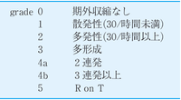

### 融合収縮

刺激伝導系を介した正常調律と異所性調律が同時か、または極めて短い時間差で心房または心室を興奮させる現象。

融合収縮には心房融合収縮と心室融合収縮がある。
洞結節からの刺激が心室に入るときに心室期外収縮が発生した場合にはQRS波は洞調律の波形と心室期外収縮の波形が合成された中間の形を示す。
波形の形はタイミングにより異なり、一定の波形を示さない。
人口ペースメーカーや心室頻拍においても融合収縮はみられる。


### 副収縮

基本の洞調律以外に心房ないしは心室に異所性のペースメーカーが存在している状態。
周囲の組織から電気的に隔絶され、自動中枢が独立した周期を示す。心室にあることが多い。
以下の様な特徴がある。

1. 先行する正常収縮との連結期が一定でない(変動連結期)。変動が0.06秒以上の時には副収縮が疑われる。
2. 調律が独立しているので、期外収縮同士のR-R間隔は一定
3. 2つの調律中枢の同時興奮により融合収縮が生じることもある
4. 心電図上最も短い副収縮同士のR-R間隔を興奮頻度とし、それぞれの副収縮同士のR-R間隔が整数倍である

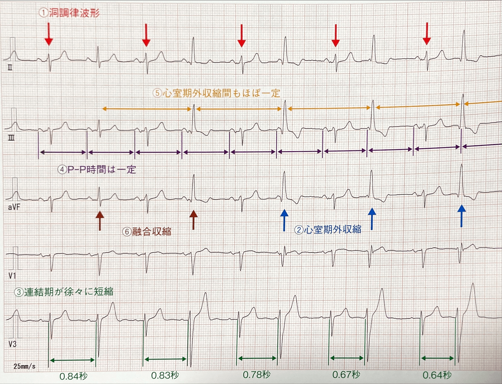

> **連結期**
>
> 洞調律のQRS波と心室期外収縮のQRS波との間隔。(上室期外収縮では洞調律のP波と期外収縮のP'波の間隔)
> 期外収縮では同じ形のものが多数出現していても連結期は一定しており、固定連結期という。
> 連結期が一定でないものは変動連結期といい、副収縮を疑う。

> **移動性ペースメーカー**
>
> 心房の複数の場所から興奮刺激が発生し心室へ伝導している状態で、少なくとも3種類の異なる形のP波が認められた場合診断される
> その結果、P波は色々な形を取り、またPR時間やQRS間隔も変動するため調律は不規則になる。
>
> 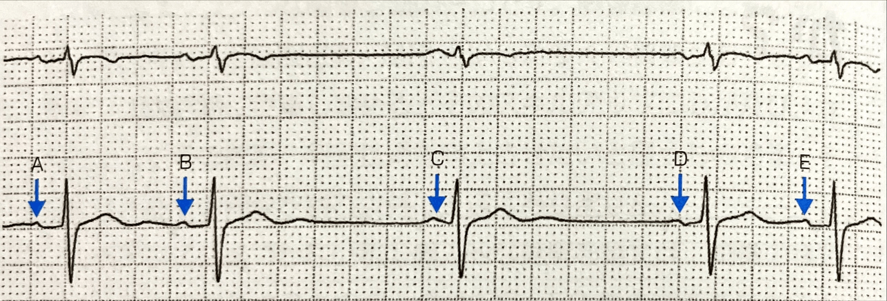

## 心房細動 (AF：Atrial Fibrillation)

* 初発心房細動 - 心電図で初めて確認されたもの
* 発作性心房細動 - 7日間以内(24時間以内に自然停止することが多い)に自然停止するもの
* 持続性心房細動 - 7日以上続き薬剤や電気的除細動で停止するもの
* 永続性心房細動 - 停止しないもの

心電図の特徴としては

1. P波の消失
2. 細動波(f波)
3. 絶対性不整脈(QRS波が不規則に出現)

> **特殊な心房細動**
>
> <u>細動波の不明瞭な例</u>
> 心房細動の病歴が長くなるとf波は徐々に減高する。細動波がはっきりしない場合には洞停止や接合部調律との鑑別を要するが、絶対性不整脈を呈することから診断可能。
>
> 
>
> <u>R-R間隔に不整を認めない例</u>
> 心房細動に完全房室ブロックを合併すると生じる。ジギタリスやβ遮断薬投与中の患者で起こることもある。
> 徐脈になることが多い。
>
> 

## QRS波の異常

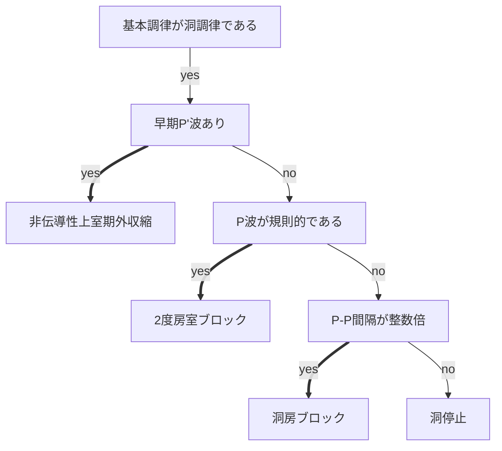
```mermaid
graph TB

A[基本調律が洞調律である] -->|yes| B[早期P'波あり]
B ==>|yes| C[非伝導性上室期外収縮]
B -->|no| D[P波が規則的である]
D ==>|yes| E[2度房室ブロック]
D -->|no| F[P-P間隔が整数倍]
F ==>|yes| G[洞房ブロック]
F -->|no| H[洞停止]
```

### 洞停止

同結節の器質的障害や種々の外因から同結節の自動能が要請され、洞結節に電気的興奮が発生しない状態。
P波は見られず、それに続くQRS-T波も見られない。刺激が再開されるタイミングが予測できないために、長いP-P間隔は洞調律の整数倍にならない。

### 洞房ブロック

洞結節での興奮は発生しているものの心房への伝導が傷害されてP波が欠如する場合をいう。

* 1度洞房ブロック - 洞房伝導時間の延長するものをいい、通常の心電図では異常としてみられない
* 2度洞房ブロック
  * Wenckebach型 - 洞房伝導時間が徐々に延長した後に心房に伝導しなくなるもので、心電図ではP-P間隔が一拍ごとに短縮していき、P-QRS-T波が脱落する。この場合のP-P間隔は正常P-P間隔の2倍よりも短くなる。
  * Mobitz II型 - 突然洞房伝導が途絶するために、突然のP-P間隔の延長としてみられ、この延長したP-P間隔は本来のP-P間隔の整数倍となる。
* 3度洞房ブロック - 洞結節の興奮が心棒に伝わらないためP波は見られず、接合部補充調律により心拍は保たれる。通常の心電図では洞停止との区別は不可能。


> **Wenchebach現象**
>
> Wenchebach型2度房室ブロックは、PQ時間が徐々に延長した後にQRS波が脱落する。脱落する前のR-R間隔は徐々に短縮していき、それをWenchebach現象という。Wenchebach型洞房ブロックも同じ現象で説明できる。
>
> 例えば、洞結節の刺激が100ごとに出るとする。洞房時間が徐々に延長するが、その延長幅は段々と短くなっていくので、P-P間隔は徐々に短縮する。
>
> 

## Wide QRS

QRS波の延長をきたす場合には、心室内の刺激伝導系の以上が考えられ、以下のような疾患があげられる

* 脚ブロック
* WPW症候群
* 心室内伝導障害 ←WPWと脚ブロックの特徴的な波形が見られない場合に考える
  * 心筋梗塞や左室肥大をきたす疾患
  * 高血圧性心疾患
  * 大動脈弁狭窄
  * 肥大型心筋症
  * 大動脈弁閉鎖不全症 など


### 脚ブロック

<u>I, V1, V6誘導のみで診断可能</u>

#### 右脚ブロック(RBBB：Right Bundle Branch Block)

1. V1誘導での三相波(rSR'あるはrsR'型)
2. I, V6誘導での幅広いS波

QRS幅が0.10秒以上0.12秒未満を不完全右脚ブロック、0.12秒以上を完全右脚ブロックという。

#### 完全左脚ブロック(LBBB)

1. V1誘導でのrSまたはQS型
2. I, V6誘導での幅広く分裂または結節を認める陽性R波
3. V1〜V3誘導での陽性T波とST上昇、V4〜V6誘導でのST下降・陰性T波

左脚ブロックの興奮開始は、右室中隔部分と右室心尖部部分から始まり、次いで右室側及び中隔左室へ伝えられますが、左室の筋量が多いために右室側の興奮は打ち消され、左室に向かうベクトルのみ残る。そのため、V1誘導では遠ざかるS波となる。
興奮の開始・広がりが正常と大きく異なるために回復過程であるT波も正常とは大きく異なり、二次的なST-T変化として現れる。

```python
# 不完全左脚ブロック
左室肥大症例に多く、肥大によるQRS波延長との区別がつきにくいとの見解や、存在自体を疑問視する声もある
```

> **間欠性右脚ブロック(intermittent RBBB)**
>
> 正常なQRS波の合間に右脚ブロックの波形が混在すること。
> 心拍数の増加により出現する場合と心拍数の減少により出現する場合があるが、心拍数が増加した時に出現する心拍依存性が多いとされる。
>
> 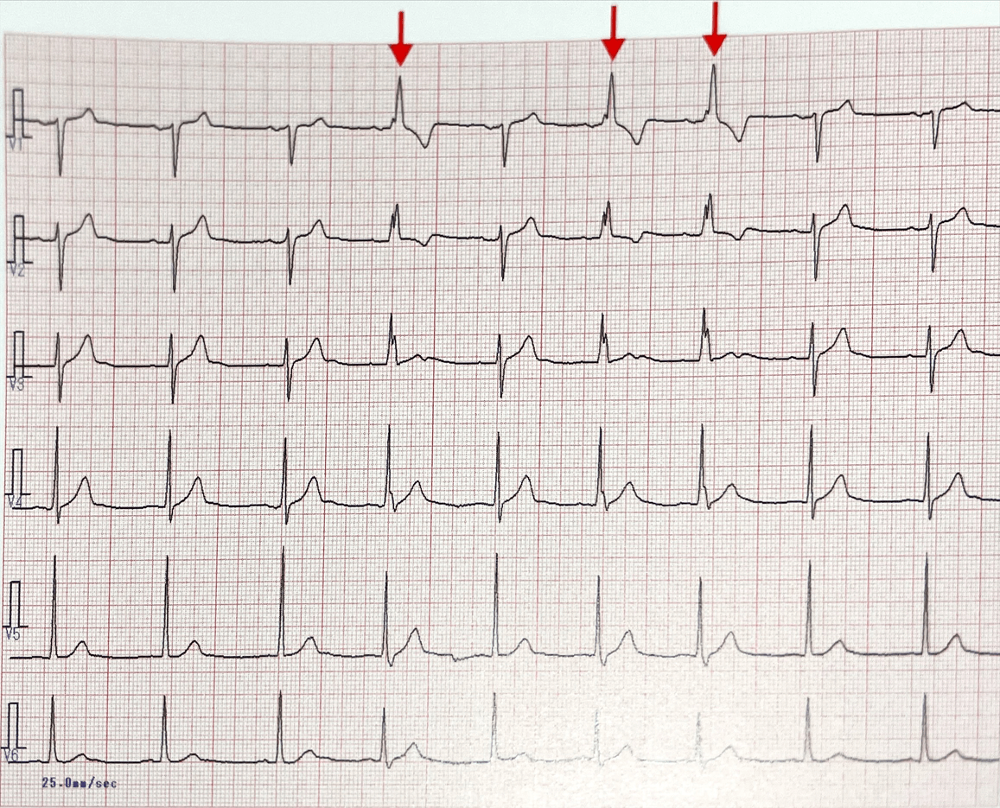

> **左脚分枝ブロック**
>
> 左脚は前枝と後枝の2本に大別されるとされており、どちらか一方の伝導障害を分枝ブロックという。
> 完全左脚ブロックと異なり、分枝ブロックでは<u>QRS幅は正常(＜0.12秒)</u>である。
>
> ＜左脚前枝ブロックの診断基準＞
>
> * QRS軸がー45°以上の左軸偏位を示す
> * QRS波がQ~I~S~III~型を示す
>
> ＜左脚後枝ブロックの診断基準＞
>
> * QRS波が＋120°以上の右軸偏位を示す
> * S~I~Q~III~型
> * 垂直位心、右室肥大、右脚ブロック、側壁梗塞、WPW症候群(B型)、その他の著しいQRS軸の右軸偏位を示す例の除外

### WPW症候群

心房と心室間に副伝導路(ケント束)が存在し、ケント束を通って早期に興奮が心室に伝わる。

* 顕性WPW症候群
* 潜在性WPW症候群 - 順行性伝導を認めず、心室から辛抱への逆伝導のみが存在し、∆波を認めない
* 間欠性WPW症候群 - 順行性伝導を間欠的に認める。∆波が見られたり見られなかったりする

心電図の特徴は、

1. PQ時間の短縮
2. ∆波の存在
3. QRS幅の延長

ケント束の位置によってA, B, C型に分けられ、特徴的な心電図所見を示す。

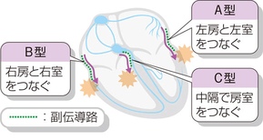

* A型：V1誘導で上向きの∆波を伴った高いR波
* B型：V1誘導でrS型
* C型：V1誘導でQS型あるいはQr型


実臨床ではさらに前後方向の情報を加えることが必要で、II, III, aVF誘導のうちの2つの誘導で∆波が陽性であれば前壁、陰性であれば後壁、いずれでもない場合には側壁または中中隔の副伝導路が疑われる。

> **房室回帰性頻拍(AVRT：Atrioventricular Reentant Tachycardia)**
>
> 心房と心室を連結する副伝導路が存在する疾患に期外収縮が起こった時に起こるリエントリー性頻拍
> WPW症候群の10〜30%に頻拍発作が認められ、AVRTはその80%ほどを占める
>
> 
>
> 
>
> 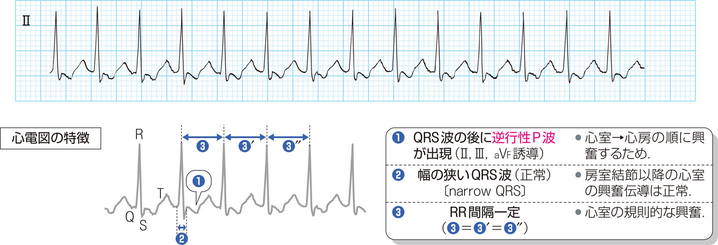

> **LGL症候群(Lown-Ganong-Levine症候群)**
>
> WPW症候群と同じようにPQ時間の短縮(0.12秒以下)を認めるが、∆波は無く、QRS幅は正常である心電図波形を示す症候群。
> 心房から房室結節下部またはHis束へ短絡するJames束を副伝導路とする。
>
> WPW症候群やLGL症候群のような、PQ間隔が0.12秒以内に短縮し心房から心室への副伝導路を介して早期に心室を興奮させる病態を早期興奮症候群と呼び、しばしば頻拍発作を合併する。

## Wide QRS 頻拍

QRS幅が0.12秒を超える頻拍のこと。
原因疾患として以下のようなものがある。

* 心室頻拍
* 脚ブロックや変行伝導を伴う心房細動・心房粗動・上室頻拍
* WPW症候群における心房細動(pseudo VT)

V1誘導でQRS波の陽性成分が陰性成分より大きい場合が右脚ブロック型、陰性成分の方が大きいまたは同程度の場合には左脚ブロック型という。


### 心室頻拍(VT：Ventricular Tachycardia)を疑う所見

* 心筋梗塞や心筋症などの基礎疾患を有する
* QRS幅が0.16秒以上、左軸偏位、胸部誘導のQRS波形の極性が同一の場合
* 右脚ブロック型でV6誘導にQS型またはrS型を示す場合
* 左脚ブロック型でV1誘導のS波の下行脚にノッチがある場合
* 房室解離が存在する
* 融合収縮が見られる

心室頻拍は、発作時のQRS波形が一定である単形性心室頻拍と、QRS波形が変化する多形性心室頻拍(polymorphic VT)に分けられる。
多形性心室頻拍はいくつかの異なる起源または伝導路に起因し、不規則で多様な形のQRS波を伴う。

#### TdP：Torsades de Pointes(倒錯型心室頻拍)

多形性心室頻拍の中でQT延長を伴う場合を呼ぶ。
QT延長が見られ、QRS波の極性と振幅が基線を軸としてねじれるように刻々と変化する多形性頻拍が記録されれば診断できる。
自然停止することが多いとされているが、ときに心室細動に移行することがあり、注意を要する。


> **QT延長症候群**
>
> 先天性と後天性のものがある。
> 先天性は遺伝子異常に基づく心筋イオンチャネルの異常で、頻度は少ないとされている。
> 後天性は薬剤、徐脈、電解質異常(低カリウム血症、低マグネシウム血症、低カルシウム血症)などの二次的要因が原因でQT延長を生じ、TdPを生じるものを言う。

> **低カリウム血症**
>
> 主な心電図変化は、U波の増高とST-T変化。
> 低カリウムの程度が強くなるに従い、U波は増高し、ST-Tは低下する。U波の増高につれてT波との区別がつきにくくなるので、「QT時間」ではなく、「QU時間」と表現されることもある。
>
> 

> **心室の受攻期**
>
> QRS波の間は心室の不応期で、前半はいかなる刺激にも反応しない絶対不応期、T波の頂点より後半は強い刺激にのみ反応する相対不応期。
> T波の頂点付近は電気的に不安定な心室の受攻期があり、ここに心室早期興奮やD.C shock、ペースメーカーによる電気刺激が生じた場合(R on T)に、TdPのような多形性心室頻拍や心室細動が誘発される。
> QT時間が延長すると不応期の延長となるために、TdPの様な危険な不整脈が誘発されやすくなる。
>
> 

### 変行伝導を伴う上室頻拍を疑う所見

* 右脚ブロック型でV1誘導などで二相性の右脚ブロック型(rSR'型)を示す場合

### 偽性心室頻拍(pseudo VT)

WPW症候群に心房細動を伴うもので、幅広いQRS波形を示し、一見心室頻拍ににていることからこう呼ばれる。
WPW症候群に心房細動が合併すると、副伝導路を経て頻回に心房興奮が心室に伝わるために、立ち上がりの緩やかなwide QRS頻拍となる。
QRS波形の初期に洞調律時の∆波と極性が類似する∆波様波形を認める。


## Narrow QRS tachycardia

QRS幅が0.12秒未満で、心拍数が100/分以上の頻拍を示すもの

* R-R間隔不整
  * 心房細動(前述)
  * 伝導比が変動する心房粗動(前述)
  * 2度房室ブロックを伴う心房頻拍
* R-R間隔一定(narrow QRS regular tachycardia)
  * 洞頻脈
  * 心房粗動
  * 上室頻拍

### 心房頻拍(AT：Atrial Tachycadia)

心房内に起源を有する頻拍で、心房内リエントリー、撃発活動(triggered activity)ないし自動能亢進によるもの。
心電図では洞調律時のP波とは異なる異所性P波(P'波)が3連発以上続き、QRS波は洞調律時と同じ形を示す。複数の興奮起源があれば様々な形のP'波が見られ、P'Q時間も一定とはならない。
心房レートが200/分を超えると1：1房室伝導することは難しく、房室ブロックによりQRS波が脱落することがある。
等電位線はほとんどで見られ、心房粗動との鑑別のポイントになる。


## Narrow QRS regular tachycardia

### 洞頻脈

運動や興奮した時、貧血や発熱、甲状腺機能亢進症などで見られ、洞調律で脈拍が100/分以上のことをいう。
P波・QRS波は正常、R-R間隔も一定。

### 心房粗動(AFL：Atrial Flutter)

右房内のリエントリーによって生じるものが多く、周期は約0.2秒で、興奮は右房から左房に伝わる。
心電図ではノコギリの歯の様な形をした心房波が見られ、「F(flutter)波」と呼ばれる。
周期が大体0.2秒のため、リズムは約300/分となる。
房室結節はこの様な速い心房刺激についていけず房室ブロックを生じ、多くは2：1伝導で心拍は150/分の頻脈となる。

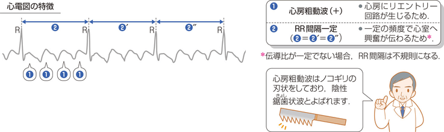

未治療例では2：1伝導が多いと言われている。
1：1や2：1ではF波がQRS波に重なって発作性上室頻拍との鑑別がしばしば困難である。
その場合には頸動脈洞マッサージや薬剤(ペラパミルやATP)で房室伝導比を低下させると鑑別が容易になる。
また、伝導比率が混在し、R-R間隔が不規則となることもある。

#### 通常型

心房中隔を下から上、右房自由壁を上から下に反時計回りに興奮が旋回する。
鋸歯状波(F波)は上行脚が急峻で下降脚が緩徐な陰性(下向き)波がII, III, aVF誘導で見られる。


#### 非通常型

時計方向に興奮が旋回し、II, III, aVF誘導で陽性(上向き)のF波が見られる。
しかし、典型的な波形を呈さない場合もあり、F波の向きだけでは診断困難。
F波が陽性、あるいは極性を判断しにくい場合には非通常型の可能性がある。


> **心房頻拍(atrial tachycardia)**
>
> 等電位線がなく鋸歯状波を形成し、心房の興奮頻度が240/min以上のものを心房粗動、形態が一定のP波が一定の間隔の等電位線を挟んで連続し、興奮頻度が240/min以下のものを心房頻拍という。
> 「等電位線がないのが心房粗動、あるのが心房頻拍」と覚えるのが簡単。
>
> 

> **等電位線(基線)**
>
> 連続するP波の立ち上がり部分を結んだ線。

### 上室頻拍

房室結節と心房が関与する不整脈で、9割が房室結節リエントリー性頻拍(atrioventricular nodal reentrant tachycardia：AVNRT)と房室回帰性頻拍(atrioventricular reciprocating tachycardia：AVRT)で、残りの1割が心房頻拍(atrial tachycardia：AT)。

#### AVNRT

房室結節周囲に興奮旋回路が存在して生じる発作性上室頻拍で、電気生理学的特性の異なる2つの伝導路である速伝導路と遅伝導路にて回路が形成される。
興奮が遅伝導路を順伝導し速伝導路を逆伝導する通常型と、その逆の稀有型があり、通常型が9割を占める。

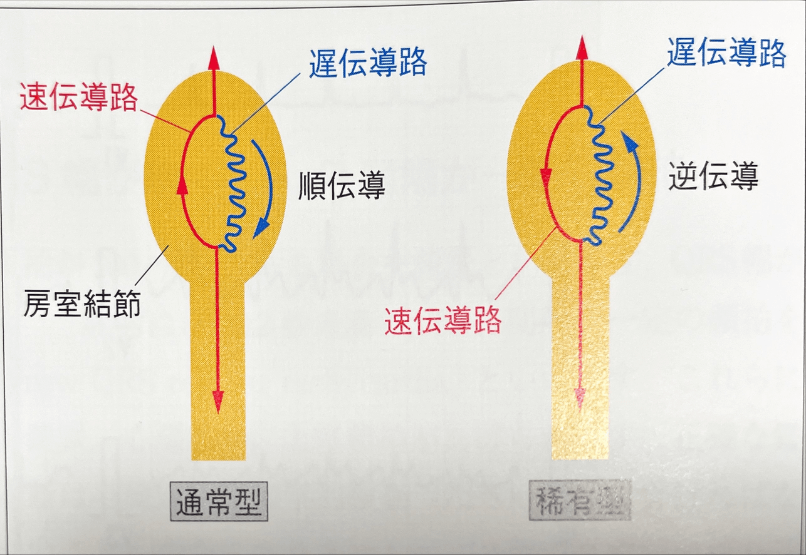

#### AVRT

副伝導路、多くはケント束を介して房室間で旋回路が形成されて生じる上室頻拍で、WPW症候群で生じる発作性上室頻拍が代表的。
通常は房室結節を順行し、副伝導路を逆行するが、まれに逆の回路を形成する時がある。

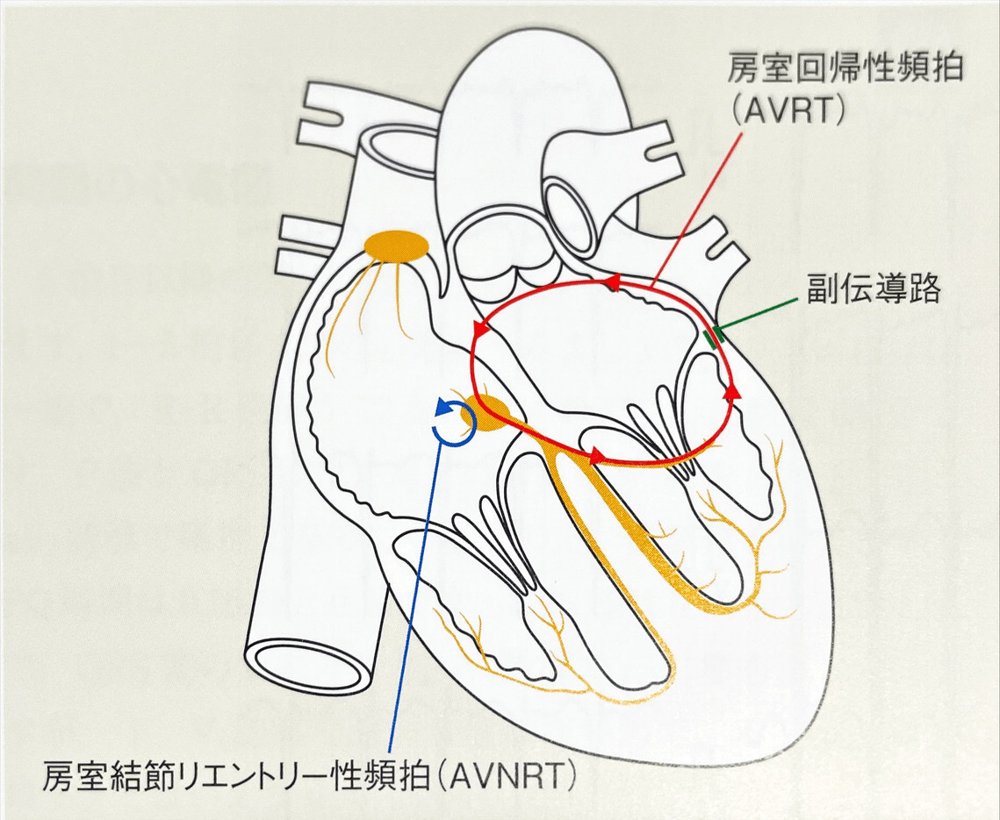

心電図での鑑別は、頻拍中の異所性P波(P'波)の位置からある程度は可能。
通常型のAVNRTは心室を旋回路に含まないため、P'波がQRS波に重なって見えないか、あるいはQRS波終末部に認められる場合がある。このQRS波の終末の小さな陰性成分はpseudo s波(V1誘導ではpseudo r'波)と呼ばれ、AVNRTを示唆する。
AVRTでは電気的興奮が「心房→房室結節→心室→ケント束→心房」の順に回旋するため、P'波はQRS波より遅れて出現し、ST部分に認められることが多い。P'波がQRS波より前にある場合、稀有型AVNRTやATが考えられる。


> **long RP' tachycardia**
>
> 稀有型AVNRTはfast pathwayからslow pathwayへ乗り換え、逆回りのエントリーを生じるため、逆行性のP'波はQRS波から大きく離れた部位に出現し、R-P'間隔＞P'-R間隔となり、long RP' tachycardiaと言われる。
>
> 

> **ATPの急速静注**
>
> ATPは洞結節の自動能と房室電導を抑制するため、上室頻拍の停止や鑑別診断に利用される。
> ATPは半減期が短いため急速静注する必要がある。
>
> 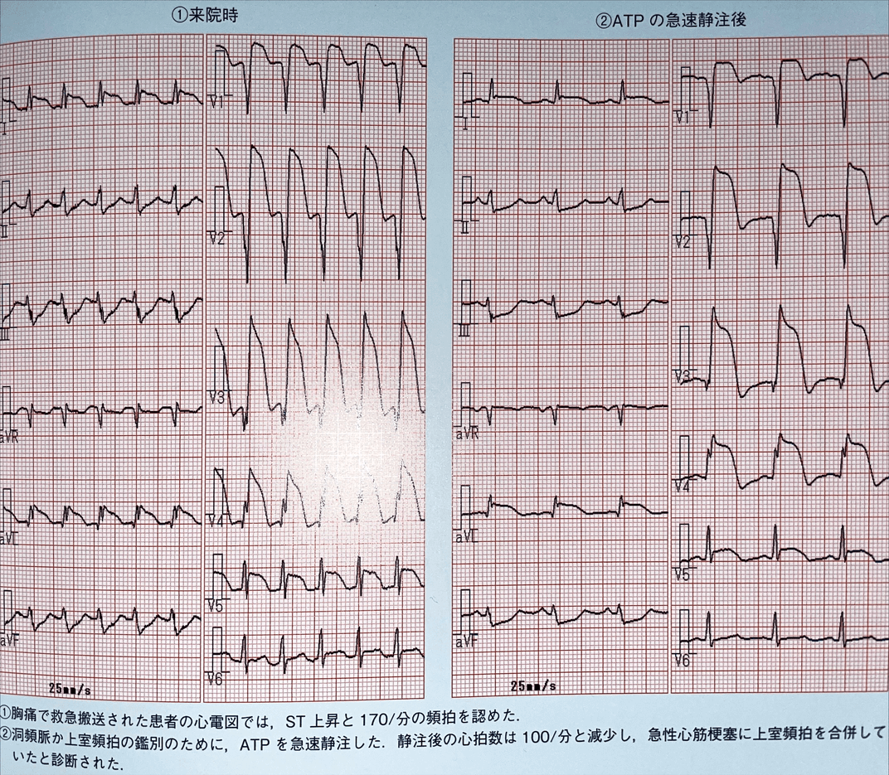

## 徐脈性不整脈

最も重要な症状として、めまいや眼前暗黒感、さらには失神発作などの脳虚血症状がある。
緊急治療を必要とする徐脈性不整脈として、洞機能不全症候群と房室ブロックがある

> **Adams-Stokes症候群**
>
> 心停止や頻脈発作などの不整脈のために脳への血流が低下または停止し、その結果、意識障害(失神)発作を起こすもの。
> 徐脈性不整脈のみならず、心室頻拍や心室細動などの頻脈生不整脈による意識障害全般も含む。

### 洞機能不全症候群(SSS：Sick Sinus Syndorome)

洞結節の自動能あるいは洞房伝導の一過性または持続的な低下により生じ、失神や心不全などの臨床症状を呈する。
心電図所見から、

1. 持続性洞徐脈
2. 洞停止あるいは洞房ブロック
3. 徐脈頻脈症候群

の3つに分けられる。

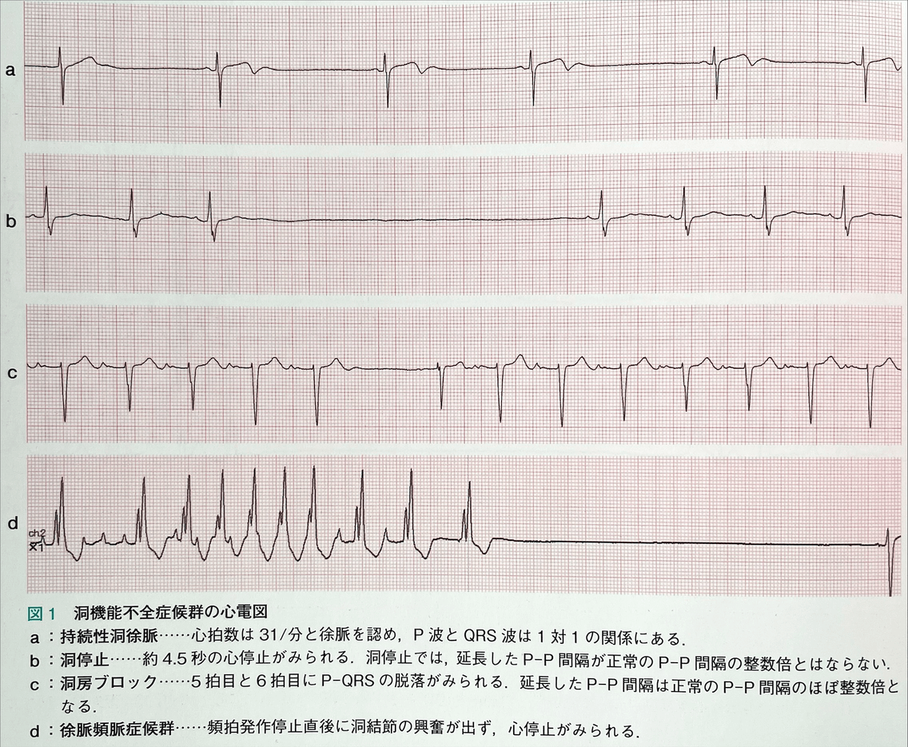

#### 洞徐脈

心拍数50/分以下の持続性徐脈で、健常人の睡眠時や運動選手などでも多くみられる。
交感神経優位の日中覚醒時にも長時間認められるものは内因性洞機能不全を伴っているものが多いとされる。

#### 洞停止・洞房ブロック

洞結節からの刺激が発生しない洞停止と、洞結節の興奮は発生しているものの刺激が心房に到達しない洞房ブロックがある。
心電図上では、P-P間隔が洞調律時の整数倍になっている洞房ブロックとそうでない洞停止に分けられているが、心電図のみではその鑑別は困難と言われている。

#### 徐脈頻脈症候群

心房細動・粗動や心房頻拍などの上室性不整脈が停止して洞調律に戻る際に著名な心停止をきたす。
発作時以外は12誘導心電図で異常を認めないことが多く、失神や眩暈などを起こす前に動悸の訴えがある場合には、ホルター心電図などを行い、不整脈停止時の心電図を確認することが必要。

### 房室ブロック

房室ブロックはI〜III度に分けられ、I度房室ブロックはQRS波の脱落はなく、PQ時間が0.21秒以上に延長したものをいう。
I度房室ブロックは多くは経過観察で良いが、3枝ブロックなどで幅広いQRS波を伴っている場合は房室結節より下位のヒス束やプルキンエ線維の伝導障害で起こっていることがあり、II度房室ブロックや完全房室ブロックに進行する可能性が高いとされる。

II度房室ブロックの中で、房室伝導比が3対1伝導より低い場合を高度房室ブロックという(下図)。
II度房室ブロックはWenckebach型とMobitz II型に分けられるが、P波の1つおきにQRS波が脱落する場合には区別ができないので、2対1房室ブロックと呼ばれる。

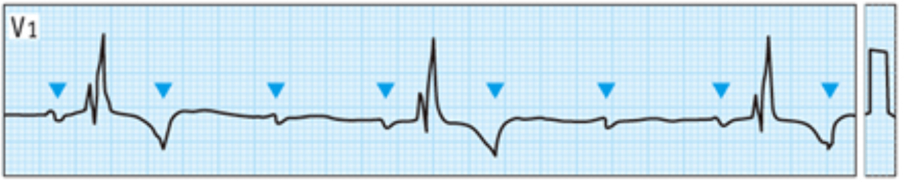

### Wenckebach型(Mobitz I型)

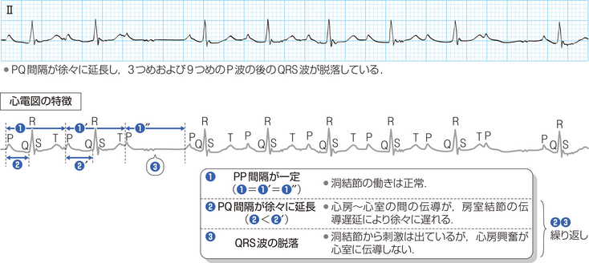

### Mobitz II型


#### 完全房室ブロック

自動能のリズムは洞結節が最も多いため、P波の数はQRS波の数より多くなる。
通常心室の固有リズムは毎分50以下であるため、徐脈を呈する。

障害部位の特定には心臓電気生理学的検査(EPS)が必要になるが、心電図のQRS幅によって推定することも可能。
QRS幅が正常であった場合には、房室接合部(房室結節またはヒス束内)、幅が広い場合には障害部位がヒス束より下位にあり、心室の刺激が脚から出ていると考えられる。
まれに心房細動に完全房室ブロックが合併することがあり、その場合は細動波(f波)を認めR-R間隔が一定であることを確認する。

たまたまPR間隔が非常に接近すると、心房が収縮した直後の僧帽弁が大きく開放したときに心室の収縮が始まり、I音が大きな音となる。これを大砲音(cannon sound)という。

#### 3枝ブロック

3つのブロックが合併している状態。
心電図上判別可能なものには以下のようなものがある。

1. 完全右脚ブロック＋左脚前枝ブロック＋房室ブロック
2. 完全右脚ブロック＋左脚後枝ブロック＋房室ブロック
3. 完全左脚ブロック＋房室ブロック

左脚後枝は障害を受けにくいため、実際には1の組み合わせがほとんど

### 房室解離(atrioventricular dissociation)

広義には完全房室ブロックも含まれるが、通常はブロックを含めない。
房室解離では房室伝導は可能であるが、心房と心室それぞれに別々のペースメーカーがあり、心房と心室が繋がっていない状態をいう。
例えば心室頻拍や心室細動では、心房は洞調律で興奮しているが心室が異常に速いレートで興奮しているために心房と心室が繋がっていない。
逆に心房のレートが遅い洞徐脈では、下位の自動能が働き、房室接合部調律や心室調律により心室が興奮することがある。心室の興奮直後では房室結節は不応期になるために洞結節の刺激が心室へ伝導されない。

房室解離の心電図ではP-P間隔とR-R間隔が同じか、あるいはP-P間隔よりR-R間隔が短いことが多い。R-R間隔は一定で、P-P間隔は変動することが多く、P波はQRS波の前後を徐々に接近したり離れたりすることが多い。
刺激伝導系は途絶していないため、たまたま不応期を脱した時に到達した刺激は心室へ伝導され、これを心室捕捉と呼ぶ。

## 左室高電位

ミネソタコードでは左室高電位の基準を以下のようにしている

1. V5あるいはV6誘導のR波の高さ≧2.6mV
2. I, II, III, aVF誘導のいずれかのR波の高さ≧2.0mVまたはaVL誘導のR波の高さ≧1.2mV
3. SV1＋RV5(RV6)≧3.5mV

左室電位は胸壁の厚さや胸水、浮腫などの影響を受けるために偽陽性・偽陰性が多いと言われている。
特に痩せ型体型の日本人の若年男性などでは高電位となりがち。
「左室高電位＝左室肥大」ではないと覚えておく。

## 左室肥大(LVH：left ventricular hypertrophy)

* 左室高電位
* 心室興奮時間(VAT)の延長(QRS幅の延長)
* ST-T変化

その他、左軸偏位、左房負荷、陰性U波などを伴うこともある

左室肥大は左室圧負荷と左室容量負荷の二種類があり、それぞれ以下の特徴を持つが、病態の進行に伴い圧負荷と同様の心電図変化となり、心電図での鑑別には限界があるとされる。
また、圧負荷による左室肥大でも軽度であれば、陽性T波を示すとされる。

> **心室興奮時間(VAT：Vantricular Activation Time)**
>
> QRS波の開始からR波の頂点までの時間を指し、心室の興奮開始から胸壁電極直下の心筋に興奮が達するまでの時間と考えられている。
> 通常の12誘導心電図ではVATの正確な計測は困難であることが多く、VATで左室肥大を判別するのは難しい。

### 左室圧負荷

* 左室高電位
* QRS幅の軽度延長
* ストレイン型ST-T変化(V5, V6で見られる)

> **ストレイン型ST-T変化**
>
> 下降脚は上に凸の緩やかな下降、上行脚が急峻な不等辺三角形型の陰性T波のこと

### 左室容量負荷

* 左室高電位
* 左側胸部誘導での増高あるいは尖鋭化したT波と深いQ波


## 低電位差

QRS波の振幅が以上に低下している状態

* **肢誘導の低電位差** - 肢誘導の全ての誘導で0.5mV未満
* **胸部誘導の低電位差** - 胸部誘導の全ての誘導で1.0mV未満

原因として、広範囲の心筋梗塞や心筋障害により心臓の起電力が低下している場合、粘液水腫、心膜液貯留、肺気腫、肥満などがある。
実際にはこの判定基準を満たす症例は少なく、QRS波の振幅の低電位の進行または改善を見ることで病態の変化を知る。

QRS波の振幅が小さいときには、まずどの誘導が低電位差であるかを見る。
全誘導で基準に達している場合は上記の疾患が考えられる。

### 肢誘導のみの低電位差

心臓の位置、特に起電力の主ベクトルが前後方向に向いていて、左右上下方向のベクトルが小さい場合が多く、健常人にも見られる

### 胸部誘導のみの低電位差

胸部誘導のみに低電位差が見られることは滅多にない。
左胸部誘導(V4〜V5)に低電位差が見られる場合には、左室側壁に何らかの異常がある、あるいは左胸水貯留、肺気腫、左側気胸などの異常があることがわかる。

> **電気的交互脈**
>
> QRS波やT波あるいはU波が一拍ごとにその大きさや極性を交互に変化させる現象のこと。
> 心膜液貯留患者に見られることがあり、心膜液の貯留により心臓の位置が一心拍ごとに変化するためと考えられている。
>
> 

## T波の見方

T波の高さは基線からT波の頂点までの高さを計測する。
正常値は、四肢誘導で0.5mV以下、胸部誘導で1.0mV以下となっている。


### 増高T波

T波が1.2mVを超える場合、または経過で前回よりも高くなったものをいう。
健常人でも高い人はいるため、判断は難しい。

以下のような疾患で見られる。

* 完全左脚ブロック - QRS幅の延長、V1誘導でのrSまたはQS型、IとV6誘導での幅広い陽性R波
* 左室肥大(容量負荷) - 左室高電位、左側胸部誘導での増高あるいは尖鋭化したT波と深いq波
* 急性心筋梗塞の早期 - 多くはST上昇を伴う。胸痛のみの場合は時間をおいて再度心電図
* 異型狭心症の発作時
* 高カリウム血症 - 幅が狭く左右対称の尖鋭化したT波(**テント状T波**)

> **洞室調律(sinoventricular rhythm)**
>
> 血清カリウム値がおよそ8.0mEq/L以上になるとP波は消失する。洞結節は血清カリウム値の影響を受けにくいために、洞結節の自動能は維持され、洞結節からの興奮が結節間経路を通って心室へ伝導する。このような現象を**洞室調律**という。
> テント状T波、QRS幅の延長、心拍数が正常もしくはほぼ正常に保たれている点が心室調律とは異なる。
>
> 

### 陰性T波

aVRは陰性T波が正常。
III, aVL, aVF誘導では正常でも陰性T波が見られることがある。
また、V1, V2誘導では、若年者や女性で軽度の陰性T波を見ることがある。小児はV1〜V3で陰性T波が見られる。

陰性T波には対称性と非対称性の陰性T波があり、急性心筋梗塞や心筋虚血で見られる左右対称性の陰性T波は、冠性T波と呼ばれる。T波は心筋の再分極の過程で形成されており、通常心筋の再分極は脱分極とは逆に心外膜→心内膜の方向に進む。そのためQRS波と同じ向きにT波は出来る。一方、心筋の壊死が存在すると壊死部分の興奮消退は遅延し、正常心筋に対して負の電位になる。そのため、T波が陰転化する。
脚ブロックやWPW症候群などの心室内伝導異常においても陰性T波が見られることがある。
また、心疾患がなくても、貧血、低蛋白血症、電解質異常、内分泌疾患、感染症などでT波の平低下や陰性T波を見ることがある。

### 巨大陰性T波(GMT：Giant Negative T waves)

陰性T波の振幅が1mV以上のもの。

原因疾患には以下のようなものがあり、それぞれに鑑別ポイントがある。
どれにせよ心電図だけの判断ではなく、心エコーは必要。

* 心尖部肥大型心筋症 - 左室高電位を伴い、GNTはV4誘導を中心に出現
* 急性心筋梗塞 - ST上昇やR波の減高、異常Q波などがあり、時間経過でGNTが見られる
* たこつぼ心筋症 - 発症直後にはST上昇を認め、数日後にGNTとQT延長を示す。鏡像変化や異常Q波は伴わない

そのほかにもQT延長症候群、肺塞栓、中枢神経疾患などさまざまな病態で見られると言われている。

## 右側胸部誘導の高電位

V1誘導のR波が0.7mV以上の場合のことを言う。

V1誘導の高電位あるいはR波高＞S波高のとき、QRS幅によって以下のような鑑別が考えられる。

### QRS幅が広いとき

* 右脚ブロック - IとV6誘導での幅広いS波、V1誘導でrsR'型
* A型WPW症候群 - ∆波

### QRS幅が正常の時

* 右室肥大 - 高いR波にST低下や陰性T波
* 後壁梗塞 - 高いR波と高い陽性T波
* 反時計方向回転 - R/S比＞1に陽性T波


## 右室肥大

### 右室圧負荷

* 肺動脈弁狭窄症
* ファロー四徴症
* 肺動脈性肺高血圧症

判定の目安として、以下のようなものがある。

* 110°を超える右軸偏位
* V1誘導のR/S比≧1
* V1誘導のR波高≧0.7mV
* V6誘導のR/S比≦1
* V1とV2誘導でのストレイン型のST-T低下
* V1誘導でのrsR'型

### 右室容量負荷

* 心房中隔欠損症
* 三尖弁閉鎖不全

右室拡大を伴うような場合には、右脚の伸展により右脚ブロックとなることがある。
判定の目安として、

* 不完全右脚ブロック
* R'波高＞0.5mV
* 右軸偏位
* V5とV6誘導の深いS波

などがある。

## 異常Q波

そもそもQ波とは、心室の中でも心室中隔の収縮を反映しているとされる。正常時には心臓の電気的中心から対称に心筋起電力が生じ釣り合いが取れているが、心筋壊死によってその部分の起電力が失われると相対的に起電力の方向は健常側(壊死部と対側)に向く。そのため、壊死部の誘導と対側のQ波が強調される。
異常Q波は<u>幅が0.04秒以上、深さがR波の1/4以上</u>のQ波と定義される。

V1誘導単独、III誘導単独、aVL誘導単独、aVR誘導単独では病的意義は乏しいとされている。


典型的な心筋梗塞では、T波の増高とST上昇に引き続いて異常Q波が出現する。次にT波は減高し、ST上昇も改善し、やがて冠性T波が出現する。T波の増高の定義は文献によって異なり、また健常人でもT波が高い場合があるため判断は難しい。
異常Q波と同一誘導でST-T変化を伴うことが多いので、ST-T変化にも注目する。

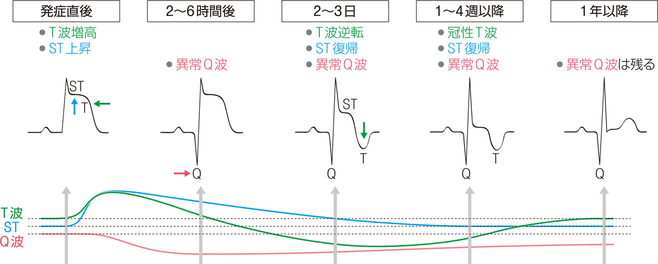

異常Q波は心筋梗塞以外にも以下のような疾患で見られる。

* 肥大型心筋症
* 拡張型心筋症
* 左脚ブロック
* WPW症候群
* 右胸心
* 左側気胸

疾患によっては心エコーなど他の追加検査が必要な場合もある。

## ST上昇

ST部分とはQRS波の終了部分(J点)からT波の開始までをいい、通常は基線に一致する。QRS波は角度が急で、ST部分は緩やかなため、角度が急なところから緩やかなところに変わる部分がJ点となる。
ST部分の高さは一般的にJ点で見る。
正常範囲は、I, II, III, aVL, aVF, V5, V6誘導で0.1mV未満、V1〜V4誘導では正常でも1mmほどのST上昇が見られるため、正常値は0.2mV未満とされる。

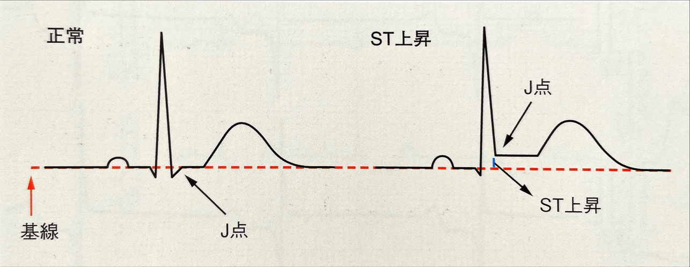

ST上昇をきたす疾患には以下のようなものがある。

* 急性心筋梗塞
* 急性心膜炎
* 急性心筋炎
* たこつぼ心筋症
* 心筋疾患
* 心室内伝導障害

など

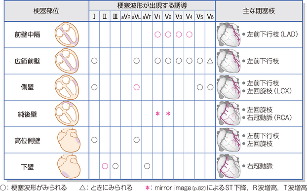

早期診断のポイントには以下の様なものがある

1. 最も感度の高い誘導に着目する(下記※1)
2. 過去に記録した心電図との比較や経時的心電図記録
3. 常に全身状態や症状などから心筋梗塞の可能性を考慮する習慣をつける
4. 心電図には限界があることを知っておく

> **※1 感度の高い誘導**
>
> 下壁梗塞の診断についてはIII誘導、前壁梗塞の診断についてはV3誘導が最も診断感度が高い。
> III誘導の対側誘導としてaVL、I誘導・V3誘導についてはII, III, aVFを近似的に対側誘導とみなしうる。
> これらの対側誘導でST上昇の相反性変化(reciprocal change)であるST低下を認めれば診断はほぼ確定する。

> **心筋梗塞後の不整脈**
>
> 心筋梗塞後には様々な種類の不整脈が見られ、急性期と慢性期では多少異なる。
> 急性期には心室頻拍が多く、次いで、心室期外収縮、心房細動や房室伝導障害がよくみられる。
>
> **心室細動**：急性心筋梗塞発症4時間以内に生じることが多く、出現頻度は2.1〜4.9%とされている。
>
> **心室頻拍**：心筋梗塞発症後48時間以内に見られることが多く、出現頻度は10〜40％とされる。
>
> **心房細動**：STEMIにみられる上室不整脈の中で最も多く、急性心筋梗塞の5〜18%にみられるとされる。
>
> **洞徐脈**：急性心筋梗塞の15〜25%にみられ、急性心筋梗塞発症1時間以内あるいは、右冠動脈の再潅流後に認められることが多い。
>
> **房室ブロック**：STEMIに関連する不整脈の6〜14%にみられる。

### 下壁梗塞

下壁梗塞の20〜30%に右室梗塞が合併すると言われており、V1〜V2誘導でST上昇が見られることがある。
また、右室梗塞を合併した下壁梗塞では、洞徐脈や房室結節動脈の閉塞による房室結節での伝導障害が生じ、I〜III度の房室ブロックが見られる。

右冠動脈が責任血管であることが多いが、左冠動脈回旋枝病変によっても生じえる。
ST上昇の程度がII誘導に比べ、III誘導の方が強い場合には責任冠動脈が右冠動脈であるとの報告がある。

### **右室梗塞**

下壁梗塞に合併することが多く、予後は不良。
疑った際には、右側胸部誘導(V3R〜V6R)を測定し、心筋梗塞に特有の心電図変化を見つけることが重要。

心電図以外の診断基準として、平均右房圧≧10mmHgかつ(平均肺動脈楔入圧 - 平均右房圧)≦5mmHgなどがある。

心筋梗塞の場合は左心不全による肺水腫のリスクを考慮し、輸液を控えることが多い。しかし、右室梗塞では前負荷を保つため輸液負荷を行う必要がある。また、右室梗塞では前負荷を減らすためニトログリセリンの投与は禁忌とされている。このように通常の心筋梗塞とは異なる治療が必要となるため、右胸部誘導を確認し、見落とさないことが大切である。

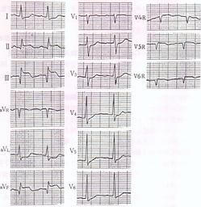

### 側壁梗塞

回旋枝の閉塞により起こることが多く、心電図ではI, aVL, V5, V6誘導に心筋梗塞に特徴的な心電図変化が見られるとされているが、実際にはST上昇が軽微な例も多く、全く心電図変化を認めないこともある

> **高位側壁枝**
>
> 通常、左冠動脈主幹部(LMT)から左前下行枝(LAD)と左回旋枝(LCX)の2つに分岐するが、まれにLADとLCXの間にもう一本の枝が見られることがある。
> これが高位側壁枝で、左室側壁を栄養する。

### 後壁梗塞

胸部誘導電極を背中(V7やV8誘導)に付け替えることでST上昇や異常Q波を見ることができるが、現実的には厳しいので、その鏡像変化をV1, V2誘導で読むことができる。
<u>異常Q波の鏡像変化がR波の増高として、冠性T波の鏡像変化が陽性T波</u>として現れる。
後壁梗塞は下壁梗塞や側壁梗塞に合併することが多く、これらが見つかれば診断特異度が高まる。
慢性的にはR波が減高するので、健常人に見られる反時計方向回転との鑑別は難しくなる。

> **下壁、側壁、後壁心筋梗塞患者の心電図**
>
> 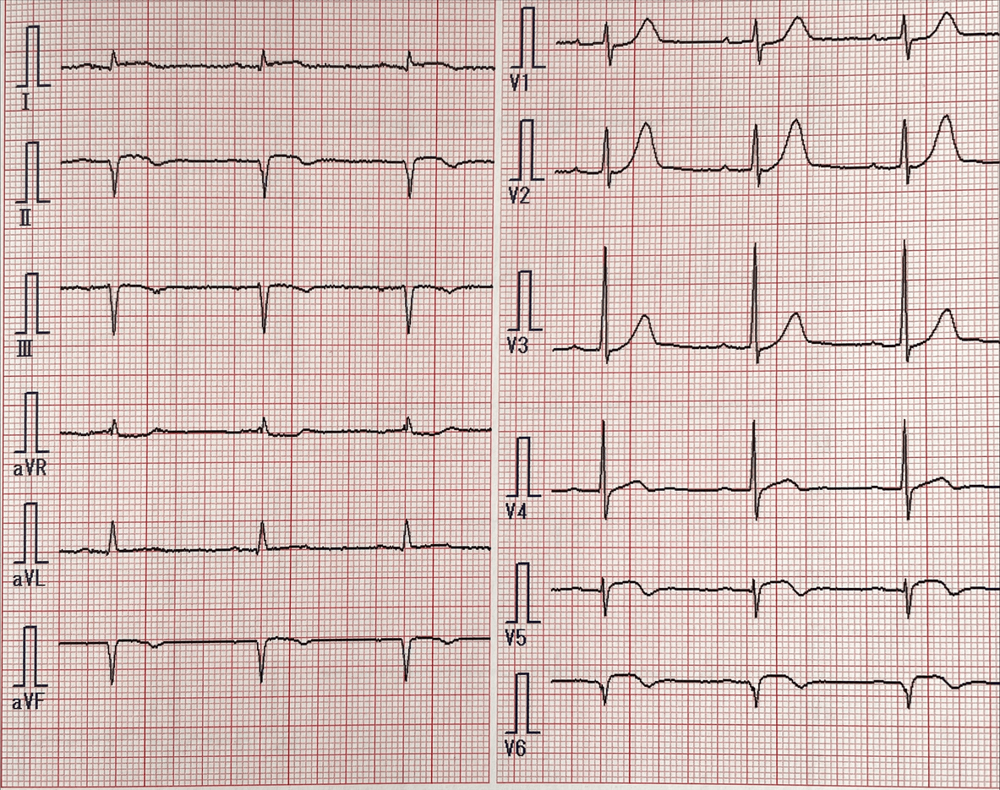
>
> I, V5, V6誘導でのST上昇とV6誘導での異常Q波を認め、側壁心筋梗塞が疑われる。
> II, III, aVF誘導はQS型を示し、下壁心筋梗塞が疑われる。
> V1とV2誘導のR/S比＞1、V1誘導の陽性T波、V2誘導の尖鋭T波から後壁心筋梗塞が疑われる。

### 左冠動脈主幹部梗塞

aVR誘導は通常はP, QRS, T波の全てが下向きの波形になる。
しかし、左冠動脈主幹部の急性心筋梗塞では左室に広範囲に虚血が生じるために多くの誘導でST低下を認め、その虚血の総和として「**aVR誘導でのST上昇**」が現れる。
広範なST低下とaVR誘導でのST上昇を認めたときには、左主幹部の心筋梗塞を考える。
また、左主幹部の心筋梗塞では、血圧低下や心機能低下のため右冠動脈は相対的心筋虚血となり、下壁誘導(II, III, aVF) で著明なST低下を認める。また、aVL誘導のST上昇や左軸偏位を伴った右脚ブロックなどの心電図変化が見られることもある。

> **心室瘤**
>
> 心筋梗塞患者の5～35％にみられ、心筋梗塞合併症においては頻度が高い。前側壁梗塞に続発することが多い。梗塞心筋の菲薄脆弱化により突出する真性瘤と、心室壁の破裂と周囲組織の癒着によって生じた仮性瘤とがある。真性瘤では限局性の膨瘤を認め、その開口部は広く、収縮期はもちろん拡張期にも瘤の突出がみられる。
>
> 診断は胸部X線における左第4弓の突出、左室造影や心エコーによる左室壁運動異常、<u>心電図上QSパターン部位での2週間以上続くSTの1mm以上の上昇</u>でなされる。
> 以下の心電図ではV1〜V4がQSパターン・冠性T波(陳旧性心筋梗塞の所見)を示し、同部位にST上昇を認める。
>
> 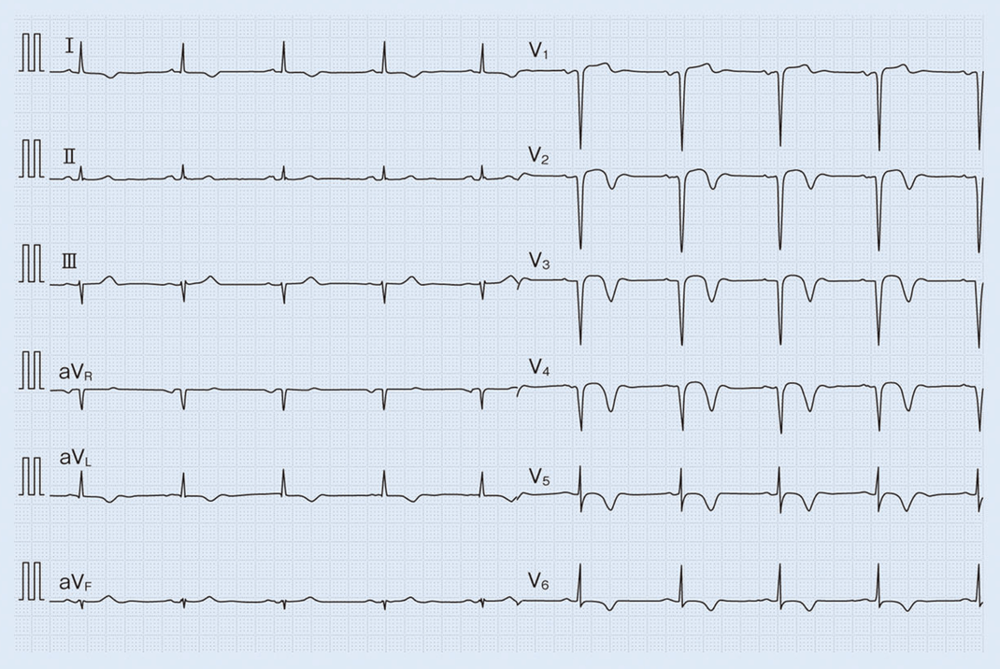

### 急性心膜炎

心筋梗塞と同様に胸痛とST上昇をきたす。重要な点は心筋梗塞で認める<u>対側性変化（鏡面変化：reciprocal change）を認めない</u>点であり、血管支配領域とは一致しない変化が特徴的である。急性心膜炎では、心膜そのものは起電力が微弱なため、心外膜に近い心筋障害により引き起こされることで、広範な変化となる。
急性心膜炎ではaVRを除く広範囲な**凹型**のST上昇が見られるが、その程度は軽いことが多い。 ←心筋梗塞は**凸型**
さらに、心房に炎症が波及した場合にはPR部分が低下する。


> **補充収縮と補充調律**
>
> 洞結節から刺激が出ない場合、あるいは何らかの機序で洞結節の興奮が心室に伝わらない場合などに、洞結節のかわりに房室接合部あるいは心室から刺激が出る場合を補充収縮(escape beat)という。
> 補充収縮は一心拍だけ出現したものをいい、連続して出現する場合は補充調律(escape rhythm)と呼ぶ。
> また、房室接合部から出る補充収縮を房室接合部補充収縮、心室から出るものを心室補充収縮と呼ぶ。
>
> 
>
> 刺激伝導系を構成する細胞は特殊心筋と呼ばれ、自発的に興奮を発生する自動能を持っている。
> 通常は洞結節がペースメーカーとなっているが、何らかの原因で洞結節の興奮が停止したり、興奮が伝わらなくなったりした場合には、より下位の自動能を持つ特殊心筋がペースメーカーとなる。
> 下位になるほど刺激発生回数は遅いので、心拍数は少なくなり徐脈となる。

### 急性心筋炎

心筋の炎症性疾患で、細菌やウイルスなどの感染によって発症する。感冒用症状や消化器症状が先行し、胸痛や呼吸困難などの心症状を認めた場合に疑う。
心電図変化は特異性に乏しいとされるが、ほとんどの症例でST上昇やST低下などのST-T変化、心室内伝導障害を反映するQRS幅の延長、異常Q波、低電位差、房室ブロックや期外収縮などの不整脈など何らかの心電図異常が認められる。
また、炎症の経時的変化とともに心電図が多彩に変化することが特徴で、心筋炎の診断のためには心電図検査を繰り返し行うことが重要であると言われている。


### たこつぼ心筋症

急性心筋梗塞に類似した発症経過で、左室心尖部を中心に無収縮を呈し、その責任病変として妥当な冠動脈病変を認めず、心電図や壁運動異常が短期間に正常化するものをさす。
収縮異常は心尖部のみではなく、さまざまな部位での収縮異常の報告がある。


心電図変化として、発症時には90%以上の症例でST上昇を認め、その後48時間以内にT波の陰転化やQT延長を伴う。
この変化は徐々に回復するが、陰性T波は数ヶ月続くことがあるとされている。

前壁心筋梗塞との違いとして、

* 鏡像変化(対側性ST低下)を認めない
* 異常Q波を認めない
* ST上昇がV1〜V3誘導よりV4〜V6誘導で顕著である
* aVRでST上昇を認めない

などが挙げられる。


## 右胸心

心臓が右胸郭内に位置異常をきたす場合を言う。
全内臓が通常と左右反対の鏡面像逆位の関係にある右胸心を鏡像右胸心といい、先天精神疾患を伴わない場合が多いとされる。

左右関係が正常と正反対になるため、心電図ではI, aVL誘導で陰性P波、aVR誘導で陽性P波となる。
左胸部誘導ではV5, V6誘導に向かうに従って心臓から遠ざかるため、R波が小さくなり、QRS波形も小さくなる。

心房細動を合併していてP波の極性がわからない場合も胸部誘導の心電図変化から疑うことができる。


右胸心が疑われる場合には、右側胸部誘導(V3R〜V6R)を記録する必要がある。


右胸心との鑑別が必要なものには、左右上肢電極のつけ間違いや、広範囲前壁心筋梗塞などがある。

### 左右上肢電極のつけ間違い

右胸心との鑑別を有するものに左右の上肢誘導電極のつけ間違いがある。
肢誘導は右胸心と同じになるが、胸部誘導の波形は変化しないため、鑑別可能。
また、I誘導でP, QRS, T波が陰性(正負が逆)になることや、II, III誘導が入れ替わっていること、aVR, aVL誘導が入れ替わっていることから鑑別できる。

### 広範囲前壁心筋梗塞

I, aVL, V1〜V6誘導に心筋梗塞の特徴的心電図変化を認める。
陳旧性広範囲前壁心筋梗塞の場合にはI, aVL, V1〜V6誘導に異常Q波が見られるので、右胸心と間違えないようにする。
aVL誘導で陽性P波、aVR誘導で陰性P波を認めるので鑑別可能。

> **左房調律**
>
> 左房筋の一部にペースメーカーを担う細胞が移動した場合をいう。
> 興奮が左房から右房に向かうが、I誘導で陰性P波を認めることは少ない。
> 左房調律の診断にはI誘導よりもV6誘導での陰性P波が重要であると言われている。

## ST低下

ST部分が基線から低下している状態をST低下といい、基線からJ点まで何mV低下しているかを測定する。

ST低下には、右上がりの上行傾斜型(upsloping type)、基線に水平の水平型(horizontal type)、右下がりの下降傾斜型(downsloping type)があり、心筋虚血に伴うST低下は、水平型・下降傾斜型が多いと言われている。

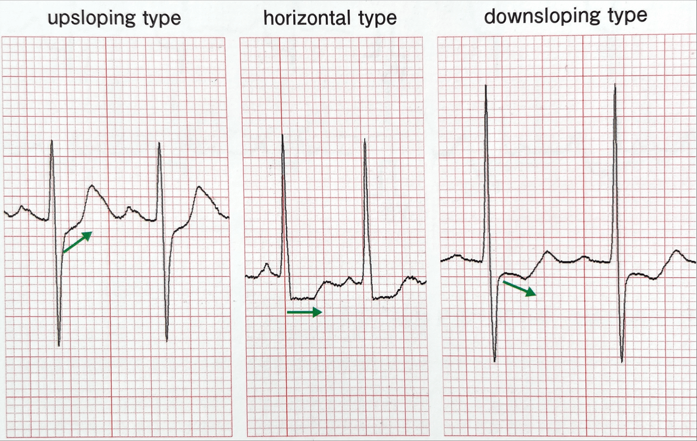

ST上昇では梗塞部位を特定できたが、ST低下では部位を推定することは困難。

ST低下は心筋虚血以外にも見られることがある。左脚ブロックやWPW症候群などの心室内伝導障害による二次性のST-T変化としてST低下があるので、QRS幅の延長が見られるときにはこれらの疾患を疑う。
また、左室肥大でもストレイン型のST-T変化を認めるので、QRS波の高さにも注目する。

> **ジギタリス効果**
>
> ジギタリスは心不全、頻脈性上室性不整脈のレートコントロールに使用される薬剤で、T波の平低化や陰転化、盆状変化が約半数に見られる。
> この変化は血中ジギタリス濃度とは相関しないため、ジギタリス中毒になってもST変化を示さないこともある。
>
> 

### 運動負荷試験

狭心症の検査としてよく利用される。
検査法としては、

* トレッドミル負荷試験
* エルゴメータ負荷試験
* マスター二段階試験

の三種類があり、上二つは心電図を装着したまま試験が可能なため、心電図に重篤な異常が生じた際には即座に中止することができる。

健常人でも運動により軽度の上行傾斜型のST低下を生じるので、<u>J点より0.08秒時点で0.1mV以上の水平型あるいは下降傾斜型のST低下を陽性とする。</u>
上行傾斜型では偽陽性が多いが、J点から0.08秒時点で0.2mVを超える低下の場合は心筋虚血を疑う。

なお、運動負荷でST上昇を認めた場合、より高度の心筋虚血を反映すると言われており、要注意。
また、運動負荷に出現する<u>陰性U波は、左主幹部あるいは左前下行枝の高度狭窄病変</u>の存在が示唆される。


## Brugada(ブルガダ)症候群

右側胸部誘導(V1〜V3)に特徴的なST上昇を認め、心室細動による突然死をきたす疾患。
特徴的なST上昇は、J点から徐々に下降し陰性T波に至る形をしているcoved型と、J点から一過性にSTが低下し、再上昇する形をしているsaddle-back型の2つで、これらのいずれかを認める場合をブルガダ型心電図という。

coved型（Type 1）が自然発生で認められた場合はそれのみでBrugada症候群の診断となるが、saddleback型の場合は失神の臨床徴候、若年の突然死の家族歴が重要となる。coved型がsaddle-back型に比べ、心室細動及び突然死の発生に密接に関連すると考えられている

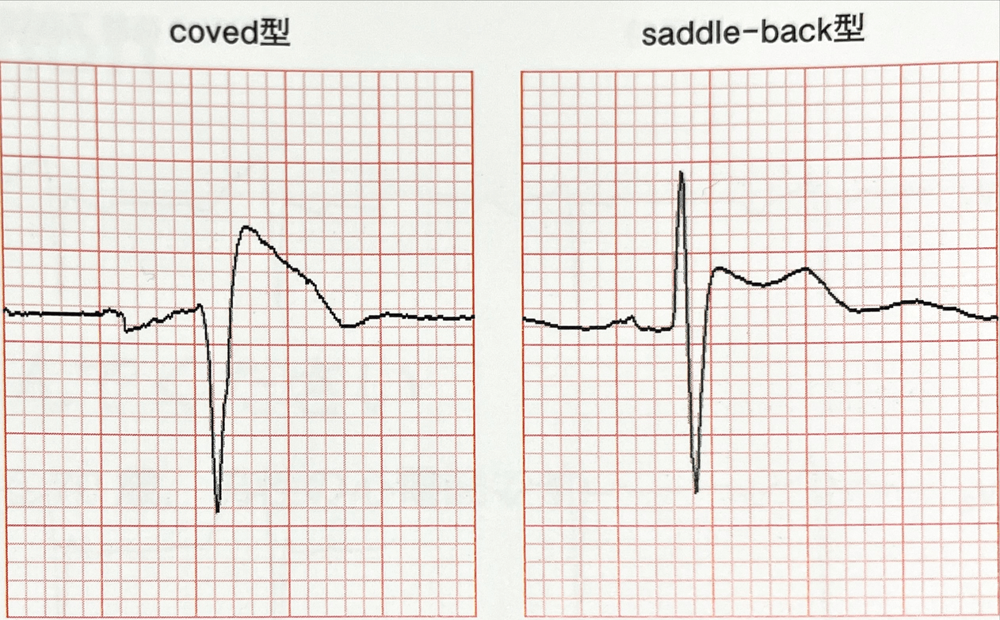

coved型のST上昇は常に現れているとは限らず、日内変動や日差変動がある。期間を空けて心電図を記録する、1〜2肋間上で記録する、薬物負荷試験(ピルジカイニド負荷試験)や運動負荷試験などを行ってcoved型ST上昇へ変化することを調べる。

さらに、
1. 多形性心室頻拍または心室細動の記録がある
2. 若年の突然死家族歴がある
3. 家族にcoved型ST上昇心電図を認める
4. 多形性心室頻拍または心室細動が電気生理学的検査で誘発される
5. 失神や夜間の瀕死期呼吸を認める

のうち1つ以上を認めた場合にはブルガダ症候群と診断される。

近年、Brugada症候群の原因として、心筋Naチャネルαサブユニット遺伝子の変異が注目されている。この異常のためNa電流が減少し、それにより特徴的な心電図所見の発現も説明されている。
したがって、<u>Naチャネルを抑制するI群抗不整脈薬は本症の不整脈を抑制しないのみならず悪化させる</u>。誘発試験に用いられる。

## QT時間

QRS波の初めからT波の終わりまでをQT時間といい、心室の興奮開始から終了まで、つまり脱分極から再分極の時間を表している。
QT時間は12誘導のうちでもっとも広い誘導を選んで計測するのがよく、一般的にはII誘導とV5誘導が計測しやすい。

QT時間の計測には2種類の方法があり、1つはQRS波の初めからT波の終末部が基線に戻ったポイントまでの時間をQT時間とする方法と、2つ目はT波の下降脚の最大傾斜部に接線を引き、その接線と基線の交点をT波終了点としてQT時間を計測する方法がある。


### QTc

QT時間は通常徐脈の時に長く、頻脈の時に短くなるため、R-R間隔で補正する補正QT時間(QTc)が使われる。
$$
Bazettの式　　　　　　　　　　　　　　　　　　　　　　\\
QTc = \frac{実測したQT時間}{\sqrt{R-R時間}}
$$
QTcの正常範囲は、0.36〜0.44秒。U波が融合することで同定は困難な場合が多い。そのため、U波が観察されにくいaVL誘導、Ⅰ誘導がQT時間の計測に適した誘導といえる。QTcの正常範囲は男性で0.44秒以下、女性で0.46秒以下であるが、QT延長症候群の診断はQTc 0.50秒以上、もしくは正常時のQTcよりも25%以上の延長が基準となる。
実際には見た目で<u>QT時間がR-R間隔の半分以下、あるいは0.5秒以下を正常</u>とするのが簡単。

### QT延長

* 先天性：Romano-Ward症候群(AD)など
* 後天性：
  * 抗不整脈薬(キニジン、ジソピラミド)や向精神薬(フェノチアジン系、ブチロフェノン系、三環系抗うつ薬など)などの薬剤
  * マクロライド系やニューキノロン系の抗菌薬
  * 完全房室ブロックや洞不全症候群などの徐脈
  * 低カリウム血症 - <u>U波の増高</u>
  * 低カルシウム血症 - <u>ST部分及びQT時間の延長</u>
  * 低マグネシウム血症
  * 急性心筋梗塞やたこつぼ心筋症などによる巨大陰性T波

> **低K(Mg)血症と低Ca血症のQT延長**
>
> 低K血症・低Mg血症・低Ca血症はいずれもQT延長をきたしうるが、低K血症・低Mg血症がTU複合波形を呈することが多いのに比べ、低Ca血症ではST部分が延長するような形を示すことが多い。
>
> 

## J波

Osborn波とも呼ばれ、心筋の脱分極の終了であるQRS波と再分極の始まりであるST segmentの境目にあるJ点が基線より隆起する波形を指す。
早期再分極を示しており、ノッチ型とスラー型がある。

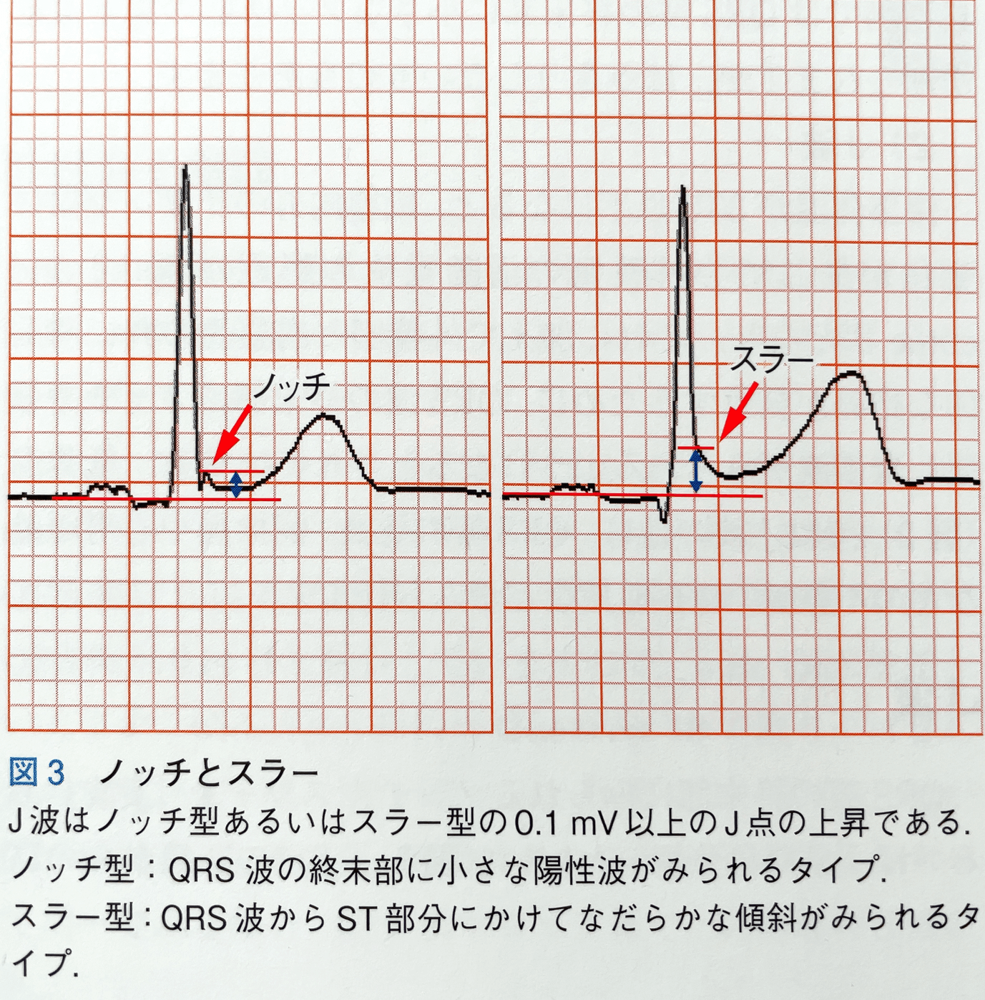

J波がみられる疾患には以下の様なものがある。

* **低体温症**
* 高カルシウム血症
* 高カリウム血症
* 脳血管障害
* コカイン中毒
* 心筋虚血
* 一部の特発性心室細動

### 低体温症

一般的には直腸温が35℃以下に低下した場合を指す。
低体温症は偶発性と二次性に分類され、偶発性低体温症は一次性低体温症とも呼ばれ、基礎疾患によらず純粋に寒冷曝露を原因として中心体温が35℃以下に低下した状態をいう。二次性低体温症とは、甲状腺機能低下症、下垂体機能低下症、糖尿病、低血糖、薬物作用、精神疾患などにより、通常では低体温症にならないレベルでの寒冷暴露で体温が下がる状態をいう。

初期には頻脈となるが、徐々に脱分極速度の低下や<u>刺激伝導系の伝導遅延</u>により**徐脈**となり、PQ時間・QRS幅・QT時間が延長する。
J波は低体温患者の80%に認められ、体温が32℃以下でみられる様になる。下壁誘導や左側胸部誘導で出現しやすく、体温が低下するほどに増高すると言われている。
また体温が32℃未満の時にはしばしば心房細動がみられる。
これらは体温が正常に復する過程で解消していく。

> **早期再分極症候群(ERS：early repolarization syndrome)とJ波症候群**
>
> 近年、J波あるいは早期再分極が心室細動や突然死に関係していることが報告され、注目されている。
>
> 早期再分極症候群の7〜8割は男性で、診断年齢は40歳前後、1〜2割には突然死の家族歴を有するとされる。
> 早期再分極は<u>Ⅱ, Ⅲ, aVF(下壁誘導)もしくはⅠ, aVL, V4～V6(側壁誘導)のいずれかの2誘導以上における0.1mV以上のスラー型またはノッチ型のJ点の上昇</u>と定義されている。しかし、右側胸部誘導に早期再分極を認める報告もあり、いまだに診断基準は決まっていない。
>
> 早期再分極症候群例に置いてJ点の高さはさまざまな状況下で変動し、時に消失する。
> 通常、J点の高さはポーズや徐脈時に増強し、心室細動発作の直前には最も高くなる。一方で、心室細動の既往のない健常人では徐脈時にJ点の高さが変化しないと言われている。
>
> J波症候群は、Brugada症候群と早期再分極症候群はJ波の部位や臨床像に違いはあるものの一連の疾患として総括することが提案されたために生まれた概念である。
> 4つのタイプに分けられ、Type1は側壁誘導にのみJ波が見られるもので、比較的若いスポーツ選手に多く、致死性不整脈のリスクは低い。Type2は下壁または下側壁誘導にJ波が見られ、致死性不整脈のリスクは中等度。Type3は下壁、側壁と左前胸部の全ての誘導に広範囲にJ波が見られるハイリスク群とし、Type1からType3の順で危険性が増すとされる。
> Type4はBrugada症候群を指す。
>
> 急性心筋梗塞時にJ波を示す場合は生命予後が悪いとされ、さまざまな心疾患や全身疾患の病態形成に関与することが明らかになっている。

## 洞不整脈(sinus arryhythmia)

刺激伝導系が正常であるにもかかわらず、洞結節における電気的刺激の発生が不規則な場合をいう。洞不整脈は呼吸の周期によって洞周期が変動する呼吸性と、呼吸周期に関係しない非呼吸性に分かれる。

呼吸性は健常者にもよくみられ、特に小児に多く、吸気によりR-R間隔が短縮し、呼気とともに延長する。
非呼吸性は本来の洞周期長より長い休止期が洞調律時に出現し、洞周期が不規則で、長い休止期が洞停止によるものか洞房ブロックによるものかは心電図では鑑別できないこともある。心疾患、重症感染症、脳圧亢進時、ジギタリスや塩酸モルヒネなどの薬剤の影響などでみられる。

上室期外収縮や非伝導性上室期外収縮、洞房ブロックなどを鑑別する必要がある。
上室期外収縮は予想される次のQRS波より早いタイミングで洞調律と同じ形のQRS波が出る。非伝導性上室期外収縮はT波上にみられるP波、洞房ブロックは次のP波が出現するタイミングがP-P間隔の整数倍などの特徴がある。

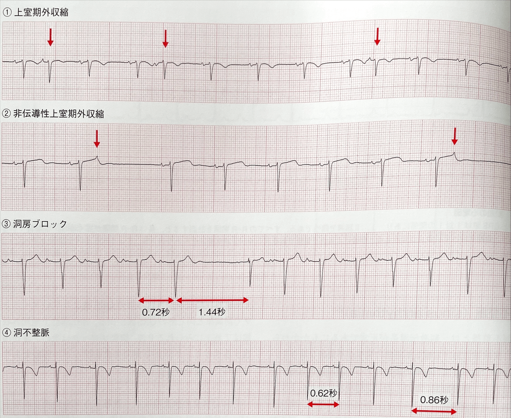

## 人工ペースメーカー

ペースメーカーには二つの機能があり、一つ目はペーシング機能で心臓に電気刺激を与え、心臓を収縮させる。二つ目はセンシング機能で、自己の興奮を感知し電気刺激を出さない機能で、これらを組み合わせて良好に心臓を働かせる。

### ICHDコード

ペースメーカーの機能を表示するために統一された分類コード。5文字で表記するが4文字目と5文字目が「O」の場合には省略できるので3文字で表されることが多い。

| 部位     | 1文字目            | 2文字目            | 3文字目       | 4文字目            | 5文字目                    |
| -------- | ------------------ | ------------------ | ------------- | ------------------ | -------------------------- |
| **項目** | **ペーシング部位** | **センシング部位** | **反応様式**  | **レート応答機能** | **マルチサイトペーシング** |
|          | A：心房            | A：心房            | I：抑制       | R：レート応答機能  | A：心房                    |
|          | V：心室            | V：心室            | T：同期       | O：なし            | V：心室                    |
|          | D：心房と心室      | D：心房と心室      | D：抑制と同期 |                    | D：心房と心室              |
|          | O：なし            | O：なし            | O：なし       |                    | O：なし                    |

**3文字目**：センシングした自己波に対してどう反応するかを表し、自己波をセンシングした場合にペーシングをしない場合は「I：inhibited」、自己波をセンシングした場合にある決められた時間後にペーシングする場合は「T：triggered」と表記する。
しかし、特殊な理由がなければ「T」を設定することはない。
心房と心室にリードがあり、心房の興奮を監視し、心房興奮があった場合にはそれに併せて心室に刺激を送って、心室に自己波を完治した場合には機器からの刺激は送らない、というように抑制と動悸の両方を行う場合には「D：dual」と表記する。

**4文字目**：体の動きや体温などを感知して必要に応じて心拍数を変動させる機能。

**5文字目**：心臓再同期療法の時に使用する機能。

#### 代表的なモード

**VVI**：徐脈性心房細動に適応され、心室にだけリードが入っている。自己波を感知した場合にはペーシングは抑制される。

**DDD**：洞不全症候群と房室ブロックに適用され、心房と心室にリードが入っている。自己波を感知すれば抑制し、自己波がなければ設定された時間後にペーシングする。

### 心電図像

心房でのペーシング波形はP波の直前にペーシングスパイクが見られるため、人工ペースメーカーによるものと判断できる。心室リードは右室に留置されるため、ペーシング波形は左脚ブロック型を示す。
心室期外収縮との違いは、QRS波の直前にペーシングスパイクが見られることと、予測される時期より早期には出ないことで鑑別が可能。

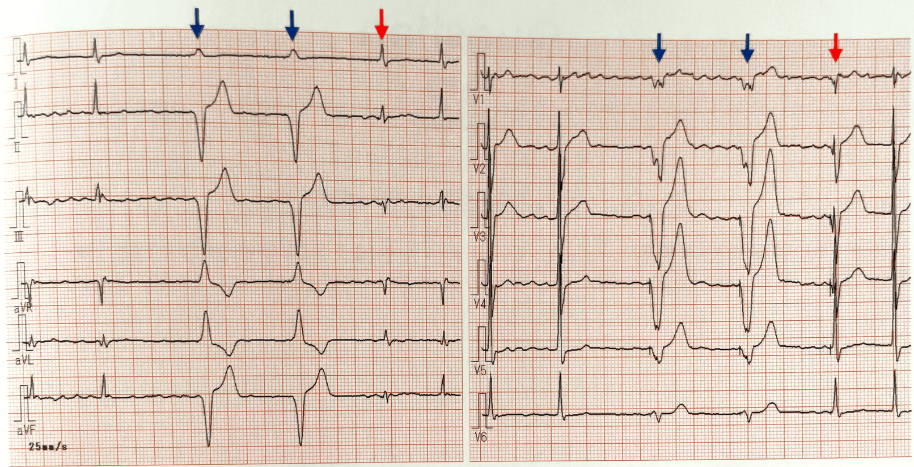

### ペーシングレート

ペースメーカーが1分間に心臓を何回刺激するかを表している。単位はppm(pulse per minute)。
例えば、ペーシングモードがDDDでペーシングレートは60〜130ppmで設定されている時、P波が1秒間出ない場合には心房ペーシングにて心房が刺激され、その後に自己のQRS波が出ない場合に心室ペーシングされQRS波が出る。そのため、心拍数が60/分以下になることはない。また、自己のP波が1分間に60〜130回の範囲では自己のP波に続いてQRS波が出なければ心室ペーシングをするが、130/分以上ではペーシングすることはない。

### AV delay

心房ペーシングと心室ペーシングの時間差を指す。通常の心電図でのPQ時間に当たる。
心房と心室のペーシングのタイミングをわずかにずらして生理的な血行動態を再現する。
P波をセンシングして、その後に自己のQRS波が出ない時に、AV delayの設定値の後に心室ペーシングをする。


### ペーシング不全

機器からのペーシングで心臓が興奮しない状態。心電図では単独のペーシングスパイクを認める。
出力を上げる、電極の位置を変えるなどの対応が必要となる。


### センシング不全

#### アンダーセンシング

自己心拍の感知不足。機器は自己波が出ていないと判断してペーシングを行う。

#### オーバーセンシング

外部からの電磁波や自身の筋電図を機器が感知して、自己波が出ていると判断し、本来出るべきペーシングスパイクが出ない。


> **心室安全ペーシング**
>
> ペースメーカーリードが心房と心室に入っていると場合に、一方のペーシングスパイクを他方のリードが感知してしまうことがある(クロストーク)。
> 心房ペーシングの直後に心室に電位を感知した場合、この電位が本当の心室電位ではなく心房ペーシングのクロストークやノイズであった場合には心停止になる可能性を考え、安全のために心室ペーシングを行う。
> 心室安全ペーシングはR on T(正確にはスパイク on T)を避けるために通常のAV delayより早期に出るため、センシング不全と鑑別できる。
> 

> **記憶T波(memorial T wave)**
>
> ペースメーカー植え込み患者で長期間にわたり心室ペーシングを行なっている例では、非ペーシング時に広範な誘導のT波が冠性T波類似の陰性T波になることがある。

## 左脚ブロックにおける急性心筋梗塞

左脚ブロックがあると急性心筋梗塞を発症した時に心電図変化が不顕性化され、心電図診断に苦慮することがある。
左脚ブロックにおける急性心筋梗塞の心電図診断基準(Sgarbossa criteria)では、合計スコアが3点以上の場合に、急性心筋梗塞の可能性が高いとされている。


しかし、この基準は特異度は高いが、感度は低いため、除外診断に用いることができない。
Sgarbossa criteriaの基準③を「STの高さをQRS波の高さで割った比がー0.25未満」に変更することにより感度が90%に上昇したと報告がある。


人工ペースメーカーの心室ペーシングの波形は左脚ブロックに似た心電図を示すため、心室ペーシングにおける急性心筋梗塞においてもこれらの基準は有用とされる。

以上の基準は左脚ブロックにおける急性心筋梗塞を発見するのに有用だが、診断基準に当てはまらなかったとしても急性心筋梗塞でないとは言えない。
発症前の心電図がある患者では、<u>必ず発症前の心電図と見比べることが必要</u>

## 不整脈原性右室心筋症(ARVC：arrhythmogenic right ventricular cardiomyopathy)

ARVCは、右室心筋が進行性に脂肪線維組織に置き換わる疾患である。変性した右心室は、右室の拡大や壁運動異常による右室不全の原因となるとともに、心室細動や心室頻拍などの致死的頻脈性不整脈の基質となり、突然死を起こすことがある。

主として右室心筋の脂肪変性と線維化が見られ、右室が拡大し、右室の一部に興奮伝導遅延が起こるもので、それが大きいと**イプシロン波(ε波)**を形成する。イプシロン波は右前胸部誘導でQRS波の後に出現する小振幅の波形で、心室頻拍と関連する右心室内の伝導遅延を反映する。ARVCに特徴的とされるが、出現頻度はそれほど高くない。

その他、右脚ブロック型のQRS波を示したり、V1〜V3誘導の**陰性T波**を認めたりする。

ARVCで見られやすい心電図所見をまとめると以下の様になる。

| 心電図所見                      | 陽性率  |
| ------------------------------- | ------- |
| イプシロン波                    | 25〜33% |
| V1〜V3の陰性T波                 | 55〜94% |
| delayed S-wave upstroke(V1〜V3) | 95%     |
| QRS幅 V1〜V3＞110ms             | 64%     |
| 右脚ブロック                    | 22%     |


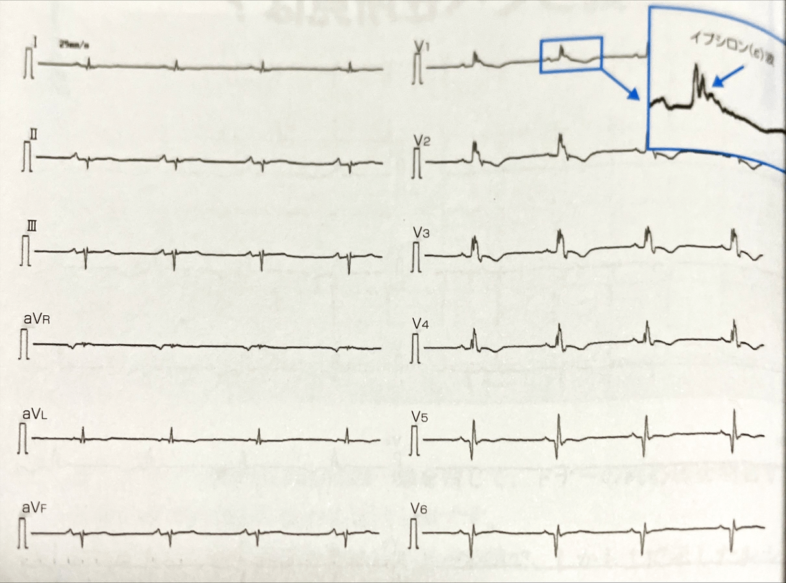

## 心臓移植後の心電図

レシピエント側の左右心房の一部を残してドナーの両心房を吻合する心臓移植(両心房法)術後では、心電図でレシピエントの心房のP波と、ドナーの心房のP波がみられる。
レシピエントのP波はQRSとは連結せず、ドナーの心房からのP波はQRSに先行する。


## 小児の心電図

### T波

胸部誘導のT波は年齢とともに著しく変化する。出生直後は全ての胸部誘導のT波が陽性であるが、数時間以内に左側胸部誘導のT波は陰性または二相性になる。生後1〜2日以内に右室圧の生理的低下に伴い、右側胸部誘導のT波は陰転化し、左側から右側に向かって順次陽性化する(V4→V1)。V1は15歳以上で陽性化するが、陰性T波が持続する例が多い。

**心房中隔欠損(ASD)**は、小児期に心電図異常を元に診断されることがあり、以下の様な特徴がある。

* QRS波の右軸偏位
* 不完全右脚ブロック
* **isolated negative T wave**(陽性T波に囲まれた中に陰性T波が存在する)


### 右室肥大

新生児期は右室優位であるため、病的右室肥大の診断が困難な場合がある。新生児期については右側胸部誘導でのq波の存在またはR波の振幅増大が、右室肥大を鑑別する上で重要とされており、次いで左側胸部誘導の深いS波、V1の陽性T波、V1のR/S≧1、V6のR/S≦1、SV6≧0.5mV、右側胸部誘導の心室興奮時間(VAT)≧0.035秒などが右室肥大を疑う所見とされている。
乳児期から学童期にかけては正常例でも右側胸部誘導におけるR波増高やT波の変化が顕著であるため注意を要する。
右室肥大を示す代表的な先天性心疾患にファロー四徴症がある。


### 左室肥大

左側胸部誘導でのST-T部の肥大性変化が重要な所見である。QRSベクトルは大きさを増して左後方に向かう。その結果、V1で深いS波、V5・V6で高いR波を示す。
先天性心疾患では最も頻度が高い心室中隔欠損症(VSD)では心不全症状を伴うような例に左室肥大診断基準を満たす例が多い。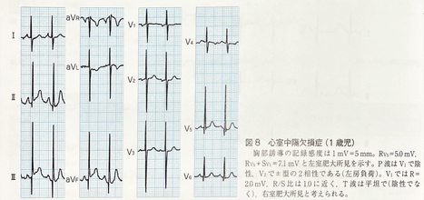

## 心アミロイドーシス

心筋にアミロイド蛋白が沈着し、伝導障害や壁肥厚をもたらす。心電図では特異的な所見はなく、病期や重症度によっては早期に心電図変化を認めないこともある。
古典的な所見としては、エコーなどで左室の壁肥厚を認めるにもかかわらず、心電図上でストレインパターンを認めず、低電位差を認めることが有名。だが、ALアミロイドーシスでは比較的高頻度に見られるのに対し、ATTRアミロイドーシスではその割合は高くない。
いずれの病型でも比較的高頻度に見られる所見として、冠動脈疾患が無いにも関わらず異常Q波やR波増高不良が認められる偽梗塞パターン(pseudoinfarct pattern, pseudonecrosis pattern)がある。
その他、伝導障害(脚ブロックや房室ブロック)や心室細動なども認めることがある。

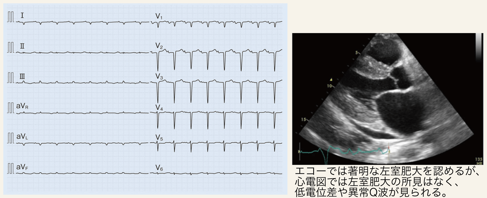

