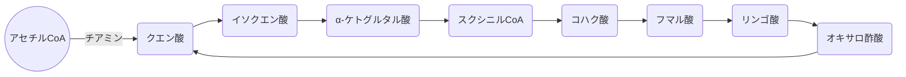
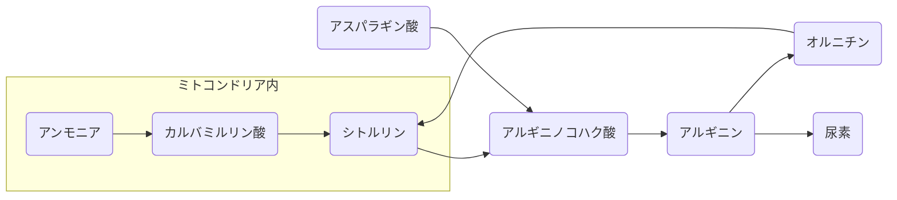
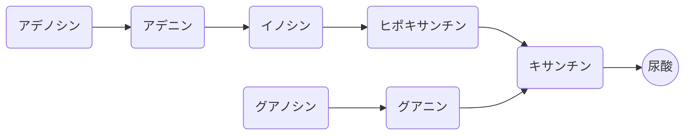
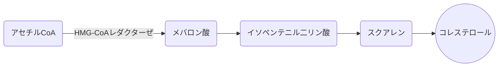
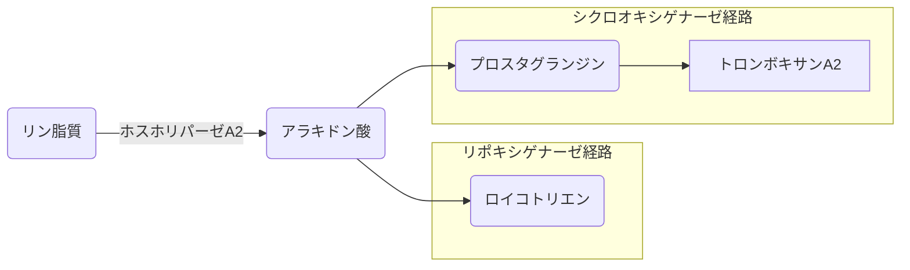

# クエン酸回路

解糖系からの前反応：$ピルビン酸 + NAD^+ + CoA → アセチルCoA + NADH + CO_2$




# 尿素回路




# プリン塩基代謝

プリン塩基には**アデニン**と**グアニン**がある




# コレステロール生合成



HMG-CoAはコレステロール合成の律速酵素、調節酵素である


# アラキドン酸カスケード




# ペントースリン酸経路

主な役割は、核酸などの構成成分のリボースの供給
$$
グルコース6ーリン酸+2NADP^++H_20 \\
→リボース5ーリン酸+2NADPH+2H^++CO_2
$$


# カテコールアミン生合成

``` mermaid
graph LR
A(チロシン/フェニルアラニン) --> B(L-dopa)
B --> C(ドパミン)
subgraph 
D(ノルアドレナリン)
E(アドレナリン)
end
C --> D
D --> E
subgraph 
F(メタネフリン)
G(ノルメタネフリン)
end
E --> F
D --> G
F --> H(VMA バニリルマンデル酸)
G --> H
```


# 腎臓における再吸収

|            | 近位尿細管 | Henle下行脚 | Henle上行脚 | 遠位尿細管 | 集合管   |
| ---------- | ---------- | ----------- | ----------- | ---------- | -------- |
| 水         | **60**     | 10          | -           | 10         | 10       |
| Na$^+$     | 70         | -           | 20          | 7          | 3        |
| Cl$^-$     | 70         | -           | 20          | 6          | 3        |
| K$^+$      | 70         | 80(分泌)    | -           | 80         | 10(分泌) |
| HCO$_3^-$  | 90         | -           | -           | 10         | -        |
| H$^+$      | 80(分泌)   | -           | -           | 10(分泌)   | -        |
| グルコース | **100**    | -           | -           | -          | -        |
| 尿酸       | **100**    | -           | -           | -          | -        |
| アミノ酸   | **100**    | -           | -           | -          | -        |

